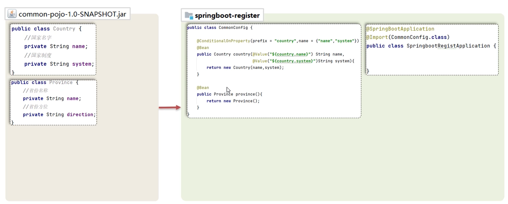

# Bean 注册与管理

> [!IMPORTANT] 必看
>
> 这一节涉及 SpringBoot 的核心原理，需要多看几遍，[🔗 视频课程](https://www.bilibili.com/video/BV14z4y1N7pg?spm_id_from=333.788.videopod.episodes&vd_source=61f3a730a0daea9e6b7d510fb19007fd&p=8)。


## Bean 扫描

原生 Spring 中想要实现 Bean 扫描，有两种方式：

::: code-group

```xml [xml扫描]
<!-- xml 方式扫描 -->
<context:component-scan base-package="com.example" />
```

```java [注解扫描]
// 配置类注解方式扫描
@ComponentScan(basePackages = "com.example")
```

:::

在 SpringBoot 中，`@SpringBootApplication` 注解标注的类中已经配置好了 Bean 扫描，因此不需要手动配置。

> [!NOTE] 提醒
>
> `@SpringBootApplication` 标记的类叫做启动类，在 Bean 扫描时，<span style="color:#CC0000;"> 只会扫描启动类所在的包及其子包 </span>。

```java {1}
@SpringBootApplication
public class Boot03DemoApplication {
  public static void main(String[] args) {
    SpringApplication.run(Boot03DemoApplication.class, args);
  }
}
```


## Bean 注入

本地项目中定义的类在注入的时候，可以使用 Spring 原生提供的注解：

|    注解     | 作用                 | 位置               |
| :---------: | -------------------- | ------------------ |
| @Component  | 声明 Bean 的基础注解 | 标注在普通类上     |
| @Controller | @Component 的衍生注解 | 标注在控制器类上   |
|  @Service   | @Component 的衍生注解 | 标注在业务类上     |
| @Repository | @Component 的衍生注解 | 标注在数据访问类上 |

> 但如果要注入的 Bean 来自第三方包中，上面原生的注解就没有办法使用了，此时需要通过 `@Bean` 或 `@Import` 注解进行注入。


### @Bean

`@Bean` 标注在方法上，就表示将该方法的返回值交给 IoC 容器管理，成为 IoC 容器的 Bean 对象。

::: code-group

```java [Product]
@Data
@AllArgsConstructor
public class Product { // 假设 Product 类是第三方的类
  private String name;
  private Integer price;
}
```

```java [AppConfig] {3,8}
@Configuration
public class AppConfig {
  @Bean // 通过 @Bean 注解，将方法的返回值交给 IoC 容器管理，Bean 的默认名称就是 方法名
  public Product product() {
    return new Product("Iphone 18", 12000);
  }

  @Bean("myProduct") // 也可以通过 @Bean 的 value 参数给 Bean 起自定义的名字
  public Product product2() {
    return new Product("Iphone 18", 12000);
  }
}
```

```java [Application] {8,12}
@SpringBootApplication
public class Application {
  public static void main(String[] args) {
    // 通过启动类的返回值可以查看所有加载的 Bean 对象
    ConfigurableApplicationContext context = SpringApplication.run(Application.class, args);

    // 通过 getBean(clazz) 方法获取注入的 Bean 对象
    Product product = context.getBean(Product.class);
    System.out.println("product = " + product);

    // 通过 getBean(beanName) 方法获取注入的 Bean 对象
    Product product1 = (Product) context.getBean("myProduct");
    System.out.println("product1 = " + product1);
  }
}
```

::: 


### @Import

> 启动类默认只注入当前类所在包及其子包下的 Bean，当把 `config/AppConfig` 文件放到启动类所在包的外面，此时使用上面的方式加载就会出错（一般不要这么做）。

为了解决这个问题，就需要使用 `@Import` 来手动注入 Bean：

```java {1}
@Import(AppConfig.class) // 将类手动注入到 IoC 容器中
// @Import({AppConfig.class, CommonConfig.class}) // 也可以使用数组的方式注入多个类
@SpringBootApplication
public class Boot04DemoApplication {
  public static void main(String[] args) {
    ConfigurableApplicationContext context = SpringApplication.run(Boot04DemoApplication.class, args);

    Product product = context.getBean(Product.class);
    System.out.println("product = " + product);
  }
}
```


同样的，上面多个类注入时要用数组来进行声明，也可以使用 `ImportSelector` 接口统一声明后再使用 `@Import` 注解手动注入。

::: code-group

```java [CommonImportSelector] {1,26}
public class CommonImportSelector implements ImportSelector {
  @Override
  public String[] selectImports(AnnotationMetadata importingClassMetadata) {
    List<String> imports = new ArrayList<>();
    // 读取 resources/common.imports 配置文件，并转为流
    // 配置文件中一行写一句 全类名
    InputStream is = CommonImportSelector.class.getClassLoader().getResourceAsStream("common.imports");
    BufferedReader br = new BufferedReader(new InputStreamReader(is));
    String line = null;
    try {
      while ((line = br.readLine()) != null) {
        // 往 imports 数组中添加 全类名
        imports.add(line);
      }
    } catch (IOException e) {
      throw new RuntimeException(e);
    } finally {
      try {
        br.close();
      } catch (IOException e) {
        throw new RuntimeException(e);
      }
    }

    // 将存有全类名的数组返回
    return imports.toArray(new String[0]);
  }
}
```

```java [Boot04DemoApplication] {2}
@SpringBootApplication
@Import(CommonImportSelector.class)
public class Boot04DemoApplication {
  public static void main(String[] args) {
    ConfigurableApplicationContext context = SpringApplication.run(Boot04DemoApplication.class, args);

    Product product = context.getBean(Product.class);
    System.out.println("product = " + product);
  }
}
```

```txt [common.imports]
com.config.AppConfig
```

:::


## 注入条件

常用的条件注入注解：

| 注解                      | 作用                                          |
| ------------------------- | --------------------------------------------- |
| @ConditionalOnProperty    | 配置文件中存在对应的 **属性**，才声明该 Bean   |
| @ConditionalOnMissingBean | 当不存在当前类型的 **Bean** 时，才声明该 Bean |
| @ConditionalOnClass       | 当前环境存在指定的这个 **类** 时，才声明该 Bean |

::: code-group

```yaml [application.yml]
product:
  name: ipad pro 13
  price: 12299
```

```java [AppConfig] {5,6,7}
@Configuration
public class AppConfig {
  @Bean
  // @ConditionalOnProperty注解条件判断，如果配置文件中product下的name和price不为空，才会注入当前Bean
  @ConditionalOnProperty(prefix = "product", name = {"name", "price"})
  public Product product(@Value("${product.name}") String name, // 通过 @Value 注解获取配置文件中的属性值
                         @Value("${product.price}") Integer price) {
    return new Product(name, price);
  }
}
```

```java [Boot04DemoApplication]
@SpringBootApplication
public class Boot04DemoApplication {
  public static void main(String[] args) {
    ConfigurableApplicationContext context = SpringApplication.run(Boot04DemoApplication.class, args);

    // 如果配置文件中没有值时，就没有注入 bean，此时获取就会报错
    Product product = context.getBean(Product.class);
    System.out.println("product = " + product);
  }
}
```

:::


::: code-group

```java [AppConfig] {11}
@Configuration
public class AppConfig {
  @Bean
  @ConditionalOnProperty(prefix = "product", name = {"name", "price"})
  public Product product(@Value("${product.name}") String name,
                         @Value("${product.price}") Integer price) {
    return new Product(name, price);
  }

  @Bean
  @ConditionalOnMissingBean(Product.class) // 当 Product 没有被注入时，才会注入 User
  public User user() {
    return new User("王一博", 25);
  }
}
```

```java [Boot04DemoApplication]
@SpringBootApplication
public class Boot04DemoApplication {
  public static void main(String[] args) {
    ConfigurableApplicationContext context = SpringApplication.run(Boot04DemoApplication.class, args);

    // 当配置文件中有属性时，Product 就会被注入，此时 User 就不会被注入
    // Product product = context.getBean(Product.class);
    // System.out.println("product = " + product);

    // 当配置文件中没有 Product 所需的属性时，Product 不会被注入，此时 User 就会被注入
    User user = context.getBean(User.class);
    System.out.println("user = " + user);
  }
}
```

:::


::: code-group

```java [AppConfig] {4,5}
@Configuration
public class AppConfig {
  @Bean
  @ConditionalOnClass(name = "org.springframework.web.servlet.DispatcherServlet") // 当存在 DispatcherServlet 时，才注入当前 Bean
  // @ConditionalOnClass(DispatcherServlet.class)
  public Product product() {
    return new Product("ipad", 12000);
  }
}
```

```java [Boot04DemoApplication]
@SpringBootApplication
public class Boot04DemoApplication {
  public static void main(String[] args) {
    ConfigurableApplicationContext context = SpringApplication.run(Boot04DemoApplication.class, args);

    Product product = context.getBean(Product.class);
    System.out.println("product = " + product);
  }
}
```

:::


