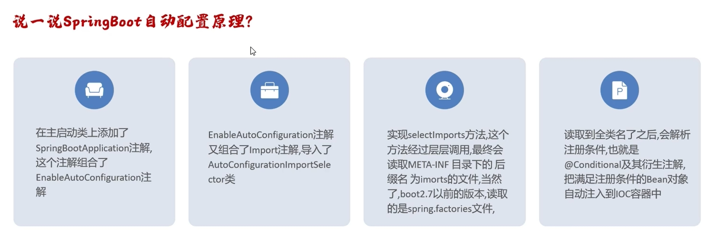

# 自动装配

自动装配就是遵循约定大于配置的原则，在 boot 程序启动以后，起步依赖中的一些 bean 对象会自动注入到 IoC 容器中。

## 自动装配的原理

> [!IMPORTANT] 必看
>
> 自动装配的原理一定要懂，面试必问点，[视频课程](https://www.bilibili.com/video/BV14z4y1N7pg?spm_id_from=333.788.videopod.episodes&vd_source=61f3a730a0daea9e6b7d510fb19007fd&p=11) 讲的很透彻。

## 自定义 starter

