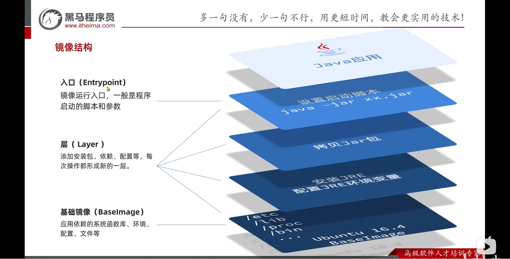

# Dockerfile

## 镜像分层结构

镜像由多个 **只读层**（read-only layers）组成，每一层代表一次文件系统的变更（例如新增文件、安装依赖、修改配置等）。

这些层被叠加在一起，就形成了一个完整的文件系统：

- **基础镜像层**：通常是操作系统的环境层，例如 `ubuntu:20.04` 或 `centos:7`；
- **应用层**：在基础镜像上安装依赖、复制文件、配置环境变量等；
- **最终层**：镜像的应用启动命令和运行配置；




## Dockerfile 语法

Dockerfile 就是一个文本文件，其中包含了一个个的 **指令**（Instruction），用指令来说明要执行哪些操作构建镜像。

常见的指令如下：

|    指令    | 说明                                           |
| :--------: | :--------------------------------------------- |
|    FROM    | 指定基础镜像                                   |
|   LABEL    | 自定义标签                                     |
|    ENV     | 设置环境变量，可在后面指令中使用               |
|    COPY    | 拷贝本地文件到镜像的指定目录                   |
|    RUN     | 执行 linux 的 shell 命令，一般是安装过程中命令 |
|   EXPOSE   | 指定容器运行时监听的端口，是给镜像使用者看的   |
| ENTRYPOINT | 镜像中应用的启动命令，容器运行时调用           |

::: code-group

```bash [基于基础镜像构建]
# 使用 JDK 21 运行环境
FROM openjdk:21-jdk-slim

# 设置时区
ENV TZ=Asia/Shanghai
RUN ln -snf /usr/share/zoneinfo/$TZ /etc/localtime && echo $TZ > /etc/timezone

# 自定义标签
LABEL author=Yibo Wang

# 拷贝 jar 包
COPY docker-demo.jar /docker-demo.jar

# 暴漏端口
# EXPOSE 8080

# 入口
ENTRYPOINT ["java", "-jar", "/docker-demo.jar"]
```

```bash [手动构建镜像]
# 指定基础镜像
FROM ubuntu:16.04
# 配置环境变量，JDK的安装目录、容器内时区
ENV JAVA_DIR=/usr/local
# 拷贝JDK和Java项目的包
COPY ./jdk8.tar.gz $JAVA_DIR/
COPY ./docker-demo.jar /tmp/app.jar
# 安装JDK
RUN cd $JAVA_DIR && tar -xf ./jdk8.tar.gz && mv ./jdk1.8.0_144 ./java8
# 配置环境变量
ENV JAVA_HOME=$JAVA_DIR/java8
ENV PATH=$PATH:$JAVA_HOME/bin
# 入口
ENTRYPOINT ["java", "-jar", "app.jar"]
```

:::

当编写好了 Dockerfile，就可以利用下面的命令来构建镜像：

> [!IMPORTANT] 注意
>
> 如果要使用 `.` 时，jar 包和 Dockerfile 文件必须放在同一个目录下。

```bash
# 构建自定义镜像
docker build -f Dockerfile -t docker-demo:v1.0.0 .
# 参数说明: 
# -f : 表示指定 Dockerfile
# -t : 表示给镜像起名字，依旧遵循 repository:tag 的格式
#  . : 是指定 Dockerfile 所在的目录，. 表示当前目录

# 运行容器
docker run -d --name docker-demo -p 8080:8080 docker-demo:v1.0.0
```


