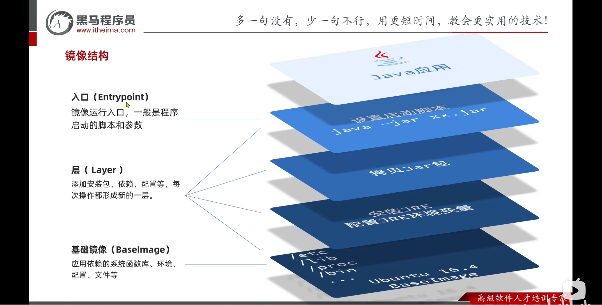

# Dockerfile 语法

镜像就是包含了 **应用程序**、程序运行的 **系统函数库**、运行 **配置文件** 的文件包。构建镜像的过程其实就是把上述文件打包的过程。


## 镜像结构

```bash {5,7-12}
[root@localhost _data]# docker pull redis
Using default tag: latest
latest: Pulling from library/redis
# 基础镜像（下载其他镜像的时候已经下载过了）
b1badc6e5066: Already exists
# redis 镜像单独需要的 layer
e51f60c71d8e: Pull complete 
311d9cf20af5: Pull complete 
f22261c94fe4: Pull complete 
6f34ca96de3f: Pull complete 
4f4fb700ef54: Pull complete 
63edde0222ea: Pull complete 
Digest: sha256:cc2dfb8f5151da2684b4a09bd04b567f92d07591d91980eb3eca21df07e12760
Status: Downloaded newer image for redis:latest
docker.io/library/redis:latest
```



## Dockerfile

Dockerfile 就是一个文本文件，其中包含了一个个的 **指令**（Instruction），用指令来说明要执行哪些操作构建镜像。将来 Docker 可以根据 Dockerfile  帮我们构建镜像。

常见的指令如下：

|    指令    | 说明                                           | 示例                                                         |
| :--------: | :--------------------------------------------- | :----------------------------------------------------------- |
|    FROM    | 指定基础镜像                                   | FROM centos: 6                                                |
|    ENV     | 设置环境变量，可在后面指令中使用               | ENV key value                                                |
|    COPY    | 拷贝本地文件到镜像的指定目录                   | COPY /xxx.tar.gz /tmp                                        |
|    RUN     | 执行 linux 的 shell 命令，一般是安装过程中命令 | RUN tar -zxvf /tmp/xxxt.tar.gz <br />&& EXPORTS path =/tmp/xxx:$path |
|   EXPOSE   | 指定容器运行时监听的端口，是给镜像使用者看的   | EXPOSE 8080                                                  |
| ENTRYPOINT | 镜像中应用的启动命令，容器运行时调用           | ENTRYPOINT java -jar xx.jar                                  |

例如，基于 ubuntu 基础镜像，利用 Dockerfile 构建一个镜像（左图）。也可以使用其他人公开构建好的基础镜像进行直接构建（右图）。


