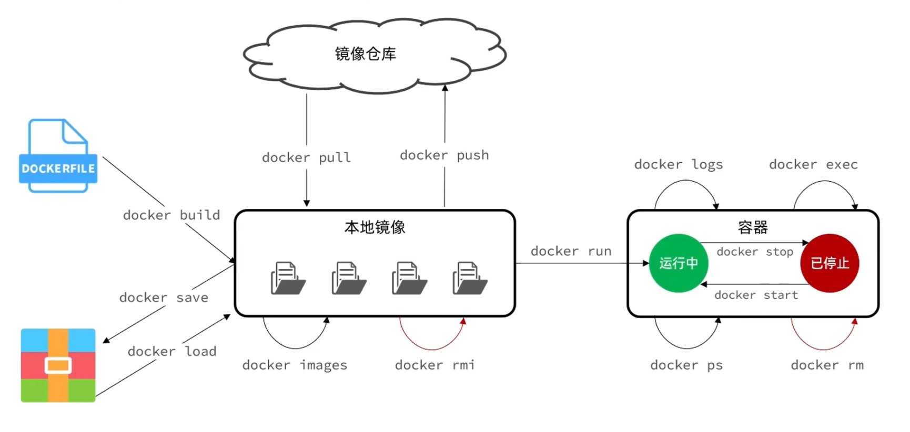

# 基础入门

Docker 是一种容器化平台，用来把应用及其依赖打包成镜像并以轻量级容器形式运行，实现“一次构建，到处运行”。


## 1.基础概念

**镜像（Image）**：镜像是一个只读的模板，包含了应用本身以及运行所需的环境、配置、系统函数库等。当我们安装或运行一个应用时，Docker 会先拉取镜像。

**容器（Container）**：容器是镜像的运行实例。Docker 在运行镜像时会创建一个独立、隔离的运行环境，也就是容器。容器与宿主机共享内核，但有独立的文件系统、进程空间等。

**镜像仓库（Registry）**：存储和分发镜像的平台。如 Docker 官方维护了一个公共仓库：[Docker Hub](https://hub.docker.com/)。


## 2.牛刀小试

从镜像源中拉取 `MySQL` 镜像，并运行：

```bash
# 拉取最新的镜像
docker pull mysql:latest

# 创建并运行 mysql 容器
# 若本地不存在 mysql 镜像，会先拉取再运行
docker run -d \
	--name mysql \
	-p 3306:3306 \
	-e TZ=Asia/Shanghai \
	-e MYSQL_ROOT_PASSWORD=1234 \
	mysql:latest
```

|     参数      | 作用                                               |
| :-----------: | -------------------------------------------------- |
| docker run -d | **创建并运行**容器，`-d` 表示让容器在后台运行      |
|  -name mysql  | 给容器起个名字，名字必须唯一                       |
| -p 3306:3306  | 端口映射：将宿主机 3306 端口映射到容器的 3306 端口 |
| -e KEY=VALUE  | 容器运行时需要配置的环境变量参数（可以没有）       |
| mysql:latest  | 指定要运行的镜像名称                               |

> [!NOTE] 镜像命名规范
>
> 镜像名称一般分为两部分组成：`[repository]:[tag]`。其中：
>
> - repository：镜像名；
> - tag：镜像的版本，若不指定，默认是 latest，表示最新版本的镜像；
>
> 


## 3.常用命令一览图



以下示例以 Nginx 为例，演示常用命令。

```bash
# 从远程仓库拉取 nginx:latest 镜像
docker pull nginx:latest

# 查看本地已有的镜像
docker images

# 启动 nginx 容器
docker run -d --name nginx -p 80:80 nginx:latest

# 查看正在运行的容器
docker ps
# 查看所有容器（包含已停止的）
docker ps -a
# 自定义输出容器列表（简洁表格形式）
docker ps --format "table {{.ID}}\t{{.Image}}\t{{.Ports}}\t{{.Status}}\t{{.Names}}"

# 停止容器
docker stop nginx

# 启动已停止的容器
docker start nginx

# 查看容器日志，-f 表示实时跟随输出
docker logs -f nginx

# 删除容器（必须先停止容器）
docker rm nginx
# 强制删除容器（不需要停止容器）
docker rm nginx -f
```


## 4.命令别名

当 docker 命令比较长时，可以在 `~/.bashrc` 文件中添加命令别名，提高效率：

```bash [.bashrc] {8,9}
# 编辑用户的 bash 配置文件
vim ~/.bashrc

# 在文件末尾写入以下别名配置
alias rm='rm -i'
alias cp='cp -i'
alias mv='mv -i'
alias dis='docker images' 
alias dps='docker ps --format "table {{.ID}}\t{{.Image}}\t{{.Ports}}\t{{.Status}}\t{{.Names}}"'

# 保存退出后，让配置立即生效
source ~/.bashrc

# 使用新别名
dis   # 等价于 docker images
dps   # 等价于 docker ps --format "table ..."
```


## 5.镜像导出与导入

有时需要在不同环境间迁移镜像，可以使用 `save` 和 `load`：

```bash {2,9,12}
# 将本地的 nginx:latest 镜像导出为一个 tar 文件
docker save -o nginx.tar nginx:latest
# 参数说明：
#   save      ：导出镜像为归档文件
#   -o <file> ：指定输出文件名，这里是 nginx.tar
#   nginx:latest ：要导出的镜像名称和标签(必须要携带标签)

# 删除本地的 nginx 镜像（这里为了测试重新导入才删除的）
docker rmi nginx

# 从 tar 文件中重新加载镜像
docker load -i nginx.tar
# 参数说明：
#   load      ：从本地文件中导入镜像
#   -i <file> ：指定输入文件，这里是 nginx.tar
```
