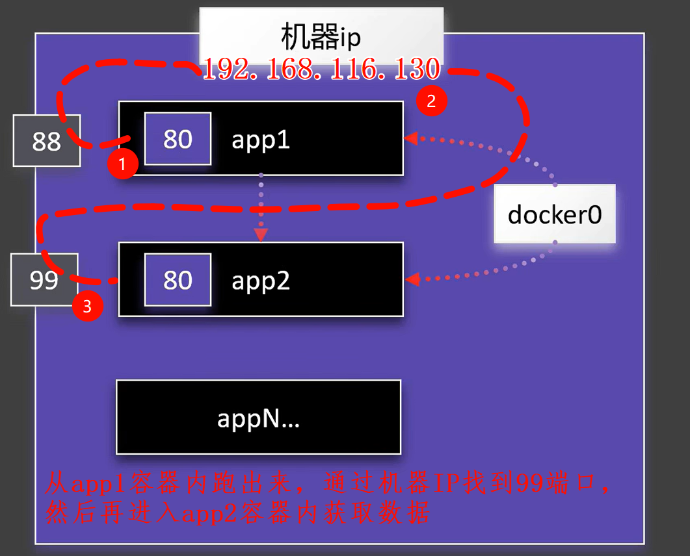

# 自定义网络

自定义网络是 Docker 提供的一种用户定义的网络类型，区别于默认的 `bridge`、`host` 等内置网络。


## 容器内部通信

同时启动两个 nignx 容器，向外暴漏端口分别为 `88` 和 `99`：

```bash
# 启动 88 端口的 nginx
docker run -d --name nginx1 -p 88:80 nginx:latest
# 启动 99 端口的 nginx
docker run -d --name nginx2 -p 99:80 nginx:latest
```

此时，如果想要在容器 `nginx2` 内部访问容器 `nginx1` 的数据，可以使用 docker0 这个默认的网络IP：

```bash
# 进入容器 nginx2 内部
docker exec -it nginx2 bash

# 获取 nginx1 的首页数据
curl http://192.168.116.130:88
```

```bash
# 查看容器详细信息
docker inspect nginx1

# 进入容器 nginx2 内部
docker exec -it nginx2 bash

# 通过容器内部的IP和端口直接进行访问
curl http://172.17.0.3:80
```

上面的命令可以获取到数据，但是通过 `192.168.116.130` 这个地址来获取，有点太过笨重了。

>好比你同事坐在你旁边，你想和他说句话，结果你跑到了公司楼下，坐着电梯上来，然后找到同事说了一句话。



> [!WARNING] 警告
>
> 通过 `docker0` 默认网络固然可以在容器间进行数据获取，但是容器内部的IP会受到容器启动顺序等原因导致IP发生变化。这时候再去访问就会出现各种问题。


## 自定义网络

创建自定义网络，并通过自定义网络启动的容器，他们都处在同一个网络环境中，因此可以通过 **容器名直接访问**，无需通过IP。

```bash
# 创建自定义网络
docker network create mynet

# 使用自定义网络启动 nginx 容器
docker run -d --name nginx1 -p 88:80 --network mynet nginx:latest
docker run -d --name nginx2 -p 99:80 --network mynet nginx:latest

# 进入 nginx1 容器内部
docker exec -it nginx1 bash

# 通过容器名直接访问
curl http://nginx2:80
```

在 `nginx1` 容器内部就可以使用容器名直接访问 `nginx2` 了。
