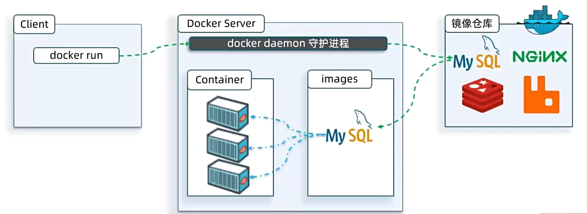
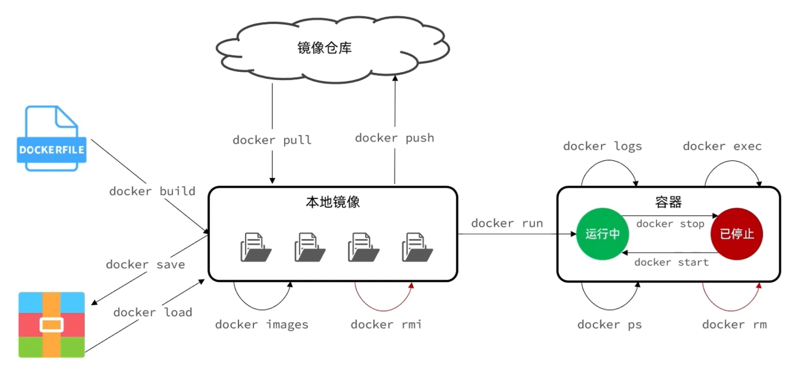

# 镜像与容器

## 镜像

**镜像（Image）** 是一个只读的模板，包含了应用本身以及运行时所需的环境、配置、系统函数库等。

**镜像仓库（Registry）** 是存储和分发镜像的平台。例如 Docker 官方维护的仓库：[Docker Hub](https://hub.docker.com/)。




### 镜像名称

镜像名称一般分为两部分组成：`[repository]:[tag]`。其中：

- `repository`：镜像名；
- `tag`：镜像的版本，若不指定，默认是 latest，表示最新版本的镜像；


### 常用命令

| 常用命令                | 作用                         |
| :---------------------- | ---------------------------- |
| docker search [image]   | 在远程仓库搜索镜像           |
| docker pull [image:tag] | 拉取镜像                     |
| docker images           | 查看本地已有的镜像           |
| docker rmi [image]      | 删除镜像（必须先终止容器）   |
| docker rmi -f [image]   | 强制删除镜像（无需终止容器） |
| docker inspect [image]  | 查看镜像详细信息             |
| docker history [image]  | 查看镜像分层构建历史         |

```bash
# 搜索 nginx 相关镜像
docker search nginx

# 拉去 nginx 镜像
docker pull nginx:latest

# 查看本地所有镜像
docker images

# 移除 nginx 镜像
docker rmi nginx:latest
docker rmi -f nginx:latest

# 查看 nginx 镜像详细信息
docker inspect nginx:latest

# 查看 nginx 镜像构建历史
docker history nginx:latest
```


### 镜像导出与导入

有时需要在不同环境间迁移镜像，可以使用 `save` 和 `load`：

```bash {2,9}
# 将本地的 nginx:latest 镜像导出为一个 tar 文件
docker save -o nginx.tar nginx:latest
# 参数说明：
#   save         ：导出镜像为归档文件
#   -o <file>    ：指定输出文件名，这里是 nginx.tar
#   nginx:latest ：要导出的镜像名称和标签(必须要携带标签)

# 从 tar 文件中重新加载镜像
docker load -i nginx.tar
# 参数说明：
#   load      ：从本地文件中导入镜像
#   -i <file> ：指定输入文件，这里是 nginx.tar
```


## 容器

**容器（Container）** 是镜像的运行实例。Docker 在运行镜像时会创建一个独立、隔离的运行环境，也就是容器。

容器与宿主机共享内核，并且容器有独立的文件系统、进程空间等（但没有系统级别的常用命令，如 `vim`）。


### 常用命令



**创建和运行：**

| 常用命令                               | 作用                                                         |
| -------------------------------------- | ------------------------------------------------------------ |
| docker create [options] [image]        | 创建容器但不启动                                             |
| docker run [image]                     | 基于镜像创建并启动容器                                       |
| docker run -d [image]                  | `-d` 用于后台自动运行容器                                    |
| docker run -e KEY = VALUE              | `-e` 用于配置容器启动的环境参数                              |
| docker run -p 3306:3306 [image]        | `-p` 用于端口映射（将宿主机 3306 端口映射到容器的 3306 端口） |
| docker run --name myapp [image]        | `--name` 用于指定容器名称                                    |
| docker run -it [image] /bin/bash       | 通过命令行交互式进入容器                                     |
| docker run -v /host:/container [image] | 数据卷挂载                                                   |

::: code-group

```bash [mysql]
# 拉取 mysql 镜像
docker pull mysql:latest

# 创建并运行 mysql 容器
docker run -d --name mysql -p 3306:3306 \
  -e TZ=Asia/Shanghai \
  -e MYSQL_ROOT_PASSWORD=1234 \
  mysql:latest
```

```bash [nginx]
# 拉取 nginx 镜像
docker pull nginx:latest

# 创建并运行 nginx 容器
docker run -d --name nginx -p 80:80 nginx:latest
```

:::


**查看和管理：**

| 常用命令                   | 作用                         |
| -------------------------- | ---------------------------- |
| docker ps                  | 查看正在运行中的容器         |
| docker ps -a               | 查看所有容器（包括已停止的） |
| docker logs [container]    | 查看容器日志                 |
| docker logs -f [container] | `-f` 用于跟踪式查看容器日志  |
| docker stats               | 查看容器资源使用情况         |

**操作容器：**

| 常见命令                   | 作用             |
| -------------------------- | ---------------- |
| docker start [container]   | 启动已停止的容器 |
| docker stop [container]    | 停止容器         |
| docker restart [container] | 重启容器         |
| docker pause [container]   | 暂停容器         |
| docker unpause [container] | 恢复容器         |

**进入和交互：**

| 常见命令                         | 作用           |
| -------------------------------- | -------------- |
| docker exec -it [container] bash | 交互式进入容器 |

**删除操作：**

| 常见命令                 | 作用                 |
| ------------------------ | -------------------- |
| docker rm [container]    | 删除容器（需先停止） |
| docker rm -f [container] | 强制删除运行中的容器 |
| docker container prune   | 删除所有已停止的容器 |

```bash
# 从远程仓库拉取 nginx:latest 镜像
docker pull nginx:latest

# 查看本地已有的镜像
docker images

# 启动 nginx 容器
docker run -d --name nginx -p 80:80 nginx:latest

# 查看正在运行的容器
docker ps
# 查看所有容器（包含已停止的）
docker ps -a
# 自定义输出容器列表（简洁表格形式）
docker ps --format "table {{.ID}}\t{{.Image}}\t{{.Ports}}\t{{.Status}}\t{{.Names}}"

# 停止容器
docker stop nginx

# 启动已停止的容器
docker start nginx

# 查看容器日志，-f 表示实时跟随输出
docker logs -f nginx

# 删除容器（必须先停止容器）
docker rm nginx
# 强制删除容器（不需要停止容器）
docker rm nginx -f
```


### 命令别名

当 docker 命令比较长时，可以在 `~/.bashrc` 文件中添加命令别名，提高效率：

```bash [.bashrc] {8,9}
# 编辑用户的 bash 配置文件
vim ~/.bashrc

# 在文件末尾写入以下别名配置
alias rm='rm -i'
alias cp='cp -i'
alias mv='mv -i'
alias dis='docker images' 
alias dps='docker ps --format "table {{.ID}}\t{{.Image}}\t{{.Ports}}\t{{.Status}}\t{{.Names}}"'

# 保存退出后，让配置立即生效
source ~/.bashrc

# 使用新别名
dis   # 等价于 docker images
dps   # 等价于 docker ps --format "table ..."
```


