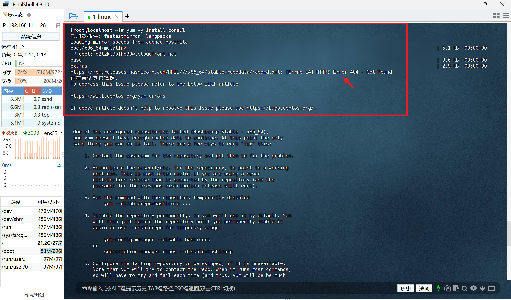

# Consul 部署

## 单机部署

**第 1 步：**

```shell
# 安装 yum 增强工具集
sudo yum install -y yum-utils
# 添加 HashiCorp 软件仓库
sudo yum-config-manager --add-repo https://rpm.releases.hashicorp.com/RHEL/hashicorp.repo
# 安装 consul
sudo yum -y install consul
```

::: warning 警告

如果在第 3 小步，安装 consul 时，命令行报错提示：



解决方法：

1. 打开 `/etc/yum.repos.d/hashicorp.repo` 文件，修改 `$releasever` 为 8 （[参考博客](https://blog.csdn.net/damien_j_scott/article/details/139283263)）：

   ```shell
   # 修改前
   baseurl=https://rpm.releases.hashicorp.com/RHEL/$releasever/$basearch/stable
   # 修改后
   baseurl=https://rpm.releases.hashicorp.com/RHEL/8/$basearch/stable
   ```

2. 重新执行 `sudo yum -y install consul` 安装 consul。

:::


**第 2 步：**

```shell
# 查看 consul 安装路径
whereis consul				# consul: /usr/bin/consul /etc/consul.d
```

编辑 `/etc/consul.d/consul.hcl`，配置以下内容（默认全部是注释的）：

```shell
# 指定运行代理的数据信息中心的名称
datacenter = "dc1"

# 定义Consul存储其状态和数据的目录
data_dir = "/opt/consul"

# 指定客户端接口绑定的地址
client_addr = "0.0.0.0"

# 配置UI界面
ui_config{
  enabled = true
}

# 指定该节点是一个服务器节点
server = true

# 绑定地址，可以是IPv4或IPv6地址
bind_addr = "[::]"  # 这是一个IPv6地址，表示所有接口
bind_addr = "0.0.0.0"  # 这是一个IPv4地址，表示所有接口

# 广播地址，用于集群中的其他节点与该节点通信
advertise_addr = "192.168.111.129"

# 指定集群预期的服务器节点数量，用于引导集群
bootstrap_expect = 1
```


**第 3 步：**

创建 `consul.service` 服务，设置 consul 开机自启。

```shell
vim /etc/systemd/system/consul.service
```

```shell
[Unit]
Description="HashiCorp Consul - A service mesh solution"
Documentation=https://www.consul.io/
Requires=network-online.target
After=network-online.target
ConditionFileNotEmpty=/etc/consul.d/consul.hcl

[Service]
EnvironmentFile=/etc/consul.d/consul.env
User=root
Group=root
ExecStart=/usr/bin/consul agent -config-dir=/etc/consul.d/
ExecReload=/bin/kill --signal HUP $MAINPID
KillMode=process
KillSignal=SIGTERM
Restart=on-failure
LimitNOFILE=65536

[Install]
WantedBy=multi-user.target
```

```shell
# 重新加载 systemd 配置
sudo systemctl daemon-reload
# 启动 consul 服务
sudo systemctl start consul
# 查看 consul 状态
sudo systemctl status consul
# 设置开机自启
sudo systemctl enable consul
```

启动成功后，在 http://192.168.111.129:8500/ui/dc1/overview/server-status 就能看到 consul 控制台啦 🎉🎉🎉！
