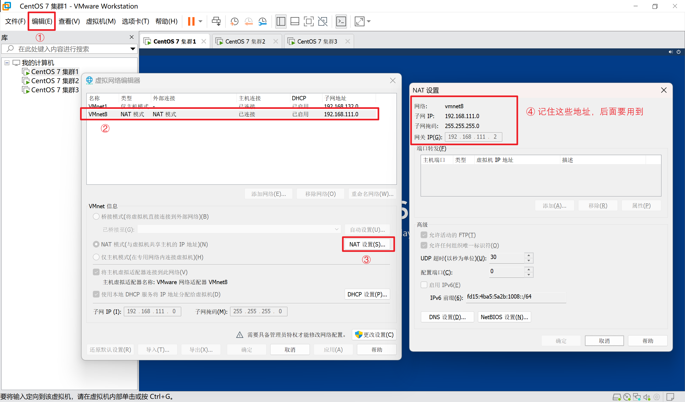

# linux固定IP地址

>教程：https://www.jb51.net/server/319492eq1.htm


**第 1 步：**

在 VM Ware 界面，点击 “编辑” -> “虚拟网络编辑器”，弹出界面如下：




**第 2 步：**

使用 vim 打开网络配置文件 `ifcfg-ens33`，并添加配置信息：

```shell
sudo vim /etc/sysconfig/network-scripts/ifcfg-ens33
```

```shell {4,15,17-20}
TYPE=Ethernet
PROXY_METHOD=none
BROWSER_ONLY=no
BOOTPROTO=static	# 修改为 static
DEFROUTE=yes
IPV4_FAILURE_FATAL=no
IPV6INIT=yes
IPV6_AUTOCONF=yes
IPV6_DEFROUTE=yes
IPV6_FAILURE_FATAL=no
IPV6_ADDR_GEN_MODE=stable-privacy
NAME=ens33
UUID=1ba1b8b2-2596-462e-8d16-d895caeec877
DEVICE=ens33
ONBOOT=yes		# 修改为 yes

IPADDR=192.168.111.128	# 前三位固定，只有最后一位可以更改
NETMASK=255.255.255.0		# 子网掩码，使用上面图中地址
GATWAY=192.168.111.2		# 网关地址，使用上面图中地址
NM_CONTROLLED=no
```


**第 3 步：**

打开 `network` 文件，配置网关相关地址，防止设置静态IP后，yum管理器无法正常解析网络地址的问题：

```shell
sudo vim /etc/sysconfig/network
```

```shell
# 新增内容
NETWORKING=yes
GATEWAY=192.168.111.2		# 网关地址，使用上面图中地址
DNS1=192.168.111.2			# 和网关地址相同
DNS2=8.8.8.8
DNS3=8.8.4.4
```


**第 4 步：**

重启网络服务：

```shell
service network restart
```