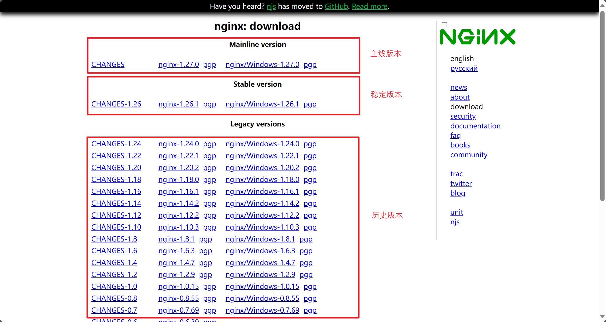

# nginx部署

#### 第 1 步

[官网下载](https://nginx.org/en/download.html) nginx 镜像文件：




#### 第 2 步

把 tar 包粘贴到 linux 中，并进行解压：

```shell
# 解压 tar 包
tar -xvf nginx-1.26.1.tar.gz
# 安装 nginx 相关依赖
yum -y install gcc zlib zlib-devel pcre-devel openssl openssl-devel
# 进入解压目录
cd nginx-1.26.1

# 执行configure脚本，安装nginx的初始化配置(--with-http_ssl_module：启动 SSL 的支持)
./configure --with-http_ssl_module
# 编译并安装
make && make install
# 进入 nginx 安装目录的 sbin 下
cd /usr/local/nginx/sbin
# 启动 nginx
./nginx
```


#### 第 3 步

开放防火墙 80 端口：

```shell
# 开放 80 端口
sudo firewall-cmd --zone=public --add-port=80/tcp --permanent
# 重启防火墙
sudo firewall-cmd --reload
```

重启防火墙后，可以在 192.168.111.129:80 看到 nginx 的启动界面了！


#### 第 4 步

设置开机自启：

```shell
vim /etc/systemd/system/nginx.service
```

```shell
[Unit]
Description=Nginx HTTP Server
After=network.target

[Service]
Type=forking
ExecStart=/usr/local/nginx/sbin/nginx
ExecReload=/usr/local/nginx/sbin/nginx -s reload
ExecStop=/usr/local/nginx/sbin/nginx -s stop
PrivateTmp=true

[Install]
WantedBy=multi-user.target
```

```shell
# 重新加载配置文件
systemctl daemon-reload
# 启动 nginx
systemctl start nginx
# 设置开机自启
systemctl enable nginx
```


#### nginx 常用命令

```shell
# 查找 nginx 安装目录
whereis nginx

# 命令启动 nginx 
/usr/sbin/nginx
# 命令启动 nginx，指定配置文件
/usr/sbin/nginx -c /etc/nginx/nginx.conf

# 修改 nginx 配置后，重新 nginx 加载配置
/usr/sbin/nginx -s reload

# 停止 nginx
/usr/sbin/nginx -s stop
```