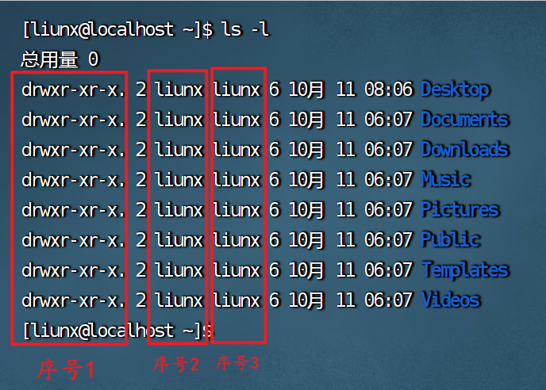

# 用户和权限

root 用户：即超级管理员，它拥有最大的系统操作权限。

普通用户：在自己的 home 目录内有权限，在其他许多地方的权限是受限制的。


## 切换账户 su

作用：用于账户切换

```shell
su -用户
```

示例：

```shell
# 切换到 root 用户
su -root

# 切换到普通用户
su -linux
```


## 回退账户 exit

作用：退回到上一个用户

::: info TIP

普通用户切换其他用户，需要密码，而 `root` 用户切换其他用户，无需密码。

:::

```shell
exit
# 或
ctrl + d
```


## 设置权限 sudo

> 我们虽然可以使用 su 命令切换到 root 得到最大的权限，但是不建议使用 root 用户去操作命令，以免误操作带来系统损坏。

在使用 sudo 命令之前，我们需要进行配置：

- 切换到 root 用户，执行 **visudo 命令**，vim 会自动打开 /etc/soduers 文件，在文件最后添加一句话：

```shell
# 用户名 ALL=(ALL)    NOPASSWD: ALL
liunx ALL=(ALL)    	 NOPASSWD: ALL
```

- 保存退出后，切换回普通用户就可以使用了。


作用：为普通的命令授权，临时以 root 身份执行

```shell
sudo 命令
```

示例：

```shell
# 使用普通用户在根目录下，创建 good 文件夹
sudo mkdir good

# 删除 good 文件夹
sudo rm -r good
```


### 用户和用户组

用户组管理（root权限）：

- 创建用户组：**`groupadd 用户组名`**

- 删除用户组：**`groupdel 用户组名`**

```shell
# 创建一个 itcast 用户组
groupadd itcast
 
# 删除itcast 用户组
groupdel itcast
```


用户管理（root权限）：

- 创建用户：**`useradd [-g -d] 用户名`**

  - -g：指定用户的组，不指定-g，会创建同名组并自动加入，指定-g需要组已经存在

  - -d：指定用户 home 目录，不指定，home目录默认在：/home/用户名

- 删除用户：**`userdel [-r] 用户名`**

  - -r：删除用户的 home 目录，不使用 -r，删除用户时，home 目录保留

- 查看用户所属组：**`id [用户名]`**

  - 用户名：被查看的用户，不提供则查看自身

- 修改用户所属组：**`usermod -aG 用户组 用户名`**

- 查看当前系统中的所有用户：**`getent passwd`**

- 查看当前系统中的所有组：**`getent group`**

```shell
# 创建 hello 用户
useradd hello
# 删除 hello 用户，并删除 home 目录
userdel -r hello
# 创建 hello 用户，指定组名为 linux，并查看当前用户所属组
useradd hello -g liunx
# 查看创建得 hello 用户所在的组信息
id hello
# 创建 hello1 用户，修改用户所属组，组名为 linux
usermod -aG liunx hello1
# 查看当前系统中的所有用户
getent passwd
# 查看当前系统中的所有组
getent group
```


### 认识权限信息



- 序号1：表示文件、文件夹的权限控制信息

- 序号2：表示文件、文件夹的所属用户

- 序号3：表示文件、文件夹的所属用户组


**序号1：**

权限细节总共分为10个槽位：


举例：drwxr-xr-x

表示：

- 字母 d ：表示是一个文件夹

- rwx：表示用户具有 r（读）、w（写）、x（执行）的权限

- r-x：表示用户组具有r（读）、w（写）、x（执行）的权限

- r-x：表示其他用户具有r（读）、w（写）、x（执行）的权限


针对文件、文件夹的不同，rwx的含义有细微差别：

- r：

  - 文件：查看文件内容

  - 文件夹：查看文件夹内容，如同 ls 命令

- w：

  - 文件：可修改此文件

  - 文件夹：可在文件夹内 创建、删除、改名等操作

- x：

  - 文件：此文件可作为程序执行

  - 文件夹：可更改工作目录到此文件夹，如同 cd 命令


### 修改权限信息

注意：只有文件、文件夹的所属用户或 root 用户可以修改。


#### chmod

作用：修改文件、文件夹的权限信息

语法：**`chmod [-R] 权限 文件或文件夹`**

参数：

- -R：对文件夹内的全部内容应用同样的权限

示例：

```shell
# 新建 hello.txt 文件，修改权限为 rwxr-x# x
chmod u=rwx,g=rx,o=x hello.txt

# 其中：
# u：user，表示用户的权限
# g：group，表示用户组的权限
# o：other，表示其他用户的权限
```


#### 权限的数组序号

权限可以用3位数字来代表，第一位数组表示用户权限，第二位表示用户组权限，第三位表示其他用户权限。

数组的细节如下：**r：4  w：2  x：1**

- 0：无任何权限，即 # -

- 1：仅有x权限，即 # x

- 2：仅有w权限，即 -w-

- 3：仅有w和x权限，即 -wx

- 4：仅有r权限，即 r# 

- 5：仅有r和x权限，即 r-x

- 6：仅有r和w权限，即 rw-

- 7：有全部权限，即 rwx

示例：`751`：表示用户：全部权限，用户组：有r和x权限，其他用户：仅有x权限

```shell
# 新建 hello.txt 文件，修改权限为 rwxr-x# x，使用数字权限序号
chmod 751 test.txt
```


### 修改用户和用户组

注意：普通用户无法修改所属的用户和用户组，因此需使用 root 权限修改！


#### chown

作用：修改用户和用户组

语法：**`chown [-R] [用户] : [用户组] 文件或文件夹`**

参数：

- -R：对文件夹内全部内容应用相同的用户或用户组

- 用户：修改所属用户

- 用户组：修改所属用户组

- `：`：用于分隔用户和用户组

示例：

```shell
# 将 hello.txt 所属用户修改为 liunx
chown liunx hello.txt
# 将 hello.txt 所属用户组修改为 liunx
chown :liunx hello.txt
# 将 hello.txt 所属用户和所属用户组都修改为 root
chown liunx:liunx hello.txt 
# 将 good 文件夹下的所有文件，所属用户和所属用户组都修改为 root
chown -R liunx:liunx good
```

