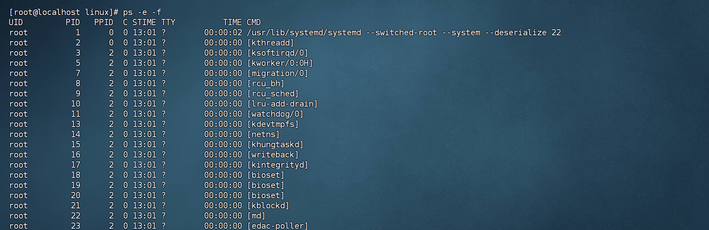

# 系统命令

### yum（安装软件）

`yum` 命令是 rpm 包软件管理器，可以在命令行中自动化安装并配置 linux 软件，并自动解决依赖问题。

> [!NOTE] 提示 
>
> yum 命令需要 root **管理员权限**，且需要联网！

```bash
yum [-y] [install | remove | search] 软件名称
# 参数说明：
#   -y ：自动确认所有提示，避免人工输入
```

::: details 示例

```bash
# 搜索 wget 软件
yum search wget

# 安装 wget 软件
yum -y install wget

# 卸载 wget 软件
yum -y remove wget
```

:::


### systemctl（管理系统服务）

`systemctl` 命令可以控制程序启动、停止、开机自启等。能够被  `systemctl` 管理的软件，一般称之为 **服务**。

> [!NOTE] 常见服务
>
> - linux 系统内置的服务比较多，如：
>
>   - NetworkManager：主网络服务
>
>   - firewalld：防火墙服务
>
>
> - 除了内置的服务，还有第三方服务，如：
>
>   - ntp 软件
>
>   - httpd 软件

```bash
systemctl start | stop | status | enable | disable 服务名称
# 参数说明：
#   start    ：开启服务
#   stop     ：关闭服务
#   status   ：查看服务运行状态
#   enable   ：设置开机自启动
#   disable  ：取消开机自启动
```

::: details 示例

```bash
# 查看 firewalld 的状态
systemctl status firewalld

# 关闭 firewalld
systemctl stop firewalld

# 开启 firewalld
systemctl start firewalld

# 关闭 firewalld 开机自启
systemctl disable firewalld

# 开启 firewalld 开机自启
systemctl enable firewalld
```

:::


### ln（软链接）

`ln` 命令可以将文件、文件夹链接到其他位置。（类似于 windows 的快捷方式）

```bash
ln -s 源文件 目标路径
# 参数说明：
#   -s        ：表示创建软链接
#   源文件     ：被链接的真实文件或目录
#   目标路径   ：符号链接生成的位置和名称
```

::: details 示例

```bash
# 查看 /etc/yum 文件夹
ls -l /etc/yum

# 将 /etc/yum 软链接到 home 目录
ln -s /etc/yum /home
```

:::


### date（查看时间）

`date` 命令用来查看系统时间。

```bash
date [-d] [+格式化字符串]
# 参数说明:
#   -d : 按照给定的字符串显示时间，一般用于日期计算
```

| 格式化字符串 | 描述                     |
| :----------: | ------------------------ |
| %Y           | 年                       |
| %y           | 年份的后两位数字         |
| %m           | 月                       |
| %d           | 日                       |
| %H           | 小时                     |
| %M           | 分钟                     |
| %S           | 秒                       |
| %s           | 1970-01-01 到现在的时间戳 |

::: details 示例

```shell
# 使用 date 命令，无参数，查看当前时间
date

# 按照 YYYY-MM-DD 的格式显示日期
date "+%Y-%m-%d"

# 按照 YYYY-MM-DD HH:mm:ss 的格式显示日期
date "+%Y-%M-%d %H:%M:%S"
```

`-d` 选项，一般用于参数计算：

```shell
# 在当前时间的基础上加一天
date -d "+1Day"

# 在当前月份的基础上加一月
date -d "+1Month"

# 在当前年份的基础上加一年
date -d "+1Year"

# 在当前小时、分钟的基础上 加一小时三十分钟
date -d "+1hour +30minute"
```

:::


> [!TIP] 时间校准
>
> 通过上面的 `date` 命令查看的日期是不准确的，因为 linux 系统默认时区不是中国的东八区。
>
> - 方式一（需要 root 权限）：
>
>   ```bash
>   # 移除 默认时区
>   rm -f /etc/localtime
>   
>   # 切换时区为亚洲/上海
>   sudo ln -s /usr/share/zoneinfo/Asia/Shanghai /etc/localtime
>   ```
>
> - 方式二（ntp 程序自动校准系统时间）：
>
>   ```bash
>   # 安装
>   yum -y install ntp
>   
>   # 设置开机自启
>   systemctl enable ntpd
>   
>   # root 权限下，手动校准
>   ntpdate -u ntp.aliyun.com
>   ```


### wget（下载网络文件）

`wget` 命令用于下载网络文件。

```bash
wget [-b] url
# 参数说明:
#   -b : 后台下载，会将日志写入到当前工作目录的 wget-log 文件
```

::: details 示例

```bash
# 前台下载 apache-hadoop3.3.0
wget https://archive.apache.org/dist/hadoop/common/hadoop-3.0.0/hadoop-3.0.0.tar.gz

# 后台下载
wget -b https://archive.apache.org/dist/hadoop/common/hadoop-3.0.0/hadoop-3.0.0.tar.gz

# 使用 tail 命令查看后台下载进度
tail -f wget-log
```

:::


### curl（发起网络请求）

`curl` 命令用于发起网络请求，如下载文件、获取信息等。

```bash
curl [-o] url
# 参数说明:
#   -o : 用于下载文件，当 url 是下载链接时，可以使用此选项保存文件。等同于 `wget url`
```

:::details 示例

```bash
# 向 cip.cc 发起网络请求
curl cip.cc
# 向 python.itheima.com 发起网络请求
curl www.baidu.com
```

:::


### ps（查看进程）

`ps` 命令用于查看系统中的进程信息。

```bash
ps [-e -f]
# 参数说明:
# -e : 显示出全部的进程
# -f : 以完全格式化的信息展示信息
```

::: details 查看进程输出内容详解



| 列名  | 描述                                     |
| :---: | ---------------------------------------- |
| UID   | 进程所属的用户 Id                         |
| PID   | 进程的进程号 Id                           |
| PPID  | 进程的父 Id                               |
| C     | 此进程的 CPU 占用率                      |
| STIME | 进程的启动时间                           |
| TTY   | 启动此进程的终端序号，`?` 表示非终端启动 |
| TIME  | 进程占用 CPU 的时间                      |
| CMD   | 进程对应的名称 / 启动路径 / 启动命令     |

:::

::: details 示例

```bash
# 查看所有进程
ps -e -f

# 启动tail命令，通过管道符过滤tail命令
tail
ps -e | grep tail

# 通过管道符过滤出进程Id为 xxxx 的进程信息
ps -ef | grep 15463
```

:::


### kill（关闭进程）

```bash
kill [-9] 进程Id
# 参数说明:
# -9 : 强制关闭进程
```

::: details 示例

```bash
# 查看tail进程的ID
ps -ef | grep tail  # 输出 17371

# 关闭进程（提示“已终止”）
kill 17371

# 启动tail进程，然后强制关闭 tail 进程（提示“已杀死”）
kill -9 17371
```

:::


### env（查看环境变量）

环境变量是操作系统在运行的时候，记录一些关键性信息，用以辅助系统运行。

```shell
# 查看环境变量
env

# 查看环境变量中 PATH 的值
echo $PATH
```


### 上传和下载

linux 提供了命令的方式下载和上传。

```bash
# 安装
yum -y install lrzsz

# 上传文件（速度比较慢）
rz

# 下载文件
sz 文件名
```


### 压缩和解压

> [!NOTE] linux常见的压缩格式 
>
> - `.tar` ：把简单的文件组装到一个 .tar 文件内，并没有太大的体积减少，只是简单的归档；
> - `.gz`：.gzip 格式的压缩文件，常见的如 `.tar.gz` 文件，它是使用 gzip 压缩算法将文件进行压缩，大大减少了体积。


#### tar压缩

作用：压缩和解压 `.tar`/ `.tar.gz` 文件。

```bash
tar [-z -c -x -v -f -C] 要压缩文件1 要压缩文件2 ...
# 参数说明:
# -z : 使用 gzip 模型压缩
# -c : 创建压缩文件，用于压缩操作
# -x : 解压参数
# -v : 显示压缩/解压过程
# -f : 压缩后的文件名称
# -C : 压缩的目的地/解压的目的地
```

::: details 示例

```bash
# 多个文件压缩为 .tar 格式
tar -cvf test1.tar 1.txt 2.md

# 多个文件压缩为 .tar.gz 格式
tar -czvf test2.tar.gz 1.txt 2.md

# 压缩 demo 文件夹下的所有内容
tar -czvf test3.tar.gz demo
```

```bash
# 解压 .tar 和 .tar.gz
tar -xvf test1.tar
tar -xzvf test2.tar.gz

# 将 .tar.gz 解压到 public 目录下
tar -xzvf test3.tar.gz public/
```

:::


#### zip压缩

`zip` 命令用于压缩文件为 .zip 压缩包。

```bash
zip [-r] 要压缩文件1 要压缩文件2 ...
# 参数说明:
# -r : 被压缩文件中包含文件夹时使用

# 将多个文件压缩为 .zip 格式
zip -r test.zip public 1.txt 2.md
```


#### unzip解压

`unzip` 命令用于解压 .zip 压缩包。解压时如果出现同名的文件，会直接覆盖！

```bash
unzip 压缩包名称 [-d] 压缩路径
# 参数说明:
# -d : 解压到指定目录

# 将 zip 解压到当前目录
unzip test.zip

# 将 zip 解压到指定目录
unzip test.zip -d public/
```


### 端口

端口，是设备与外界通讯交流的出入口，端口可分为 物理端口 和 虚拟端口 两类。

linux 系统是一个超大号小区，可以支持 65535 个端口，这么多端口可分为 3 类使用：

- 公认端口：1~1023，通常用于一些系统内置或知名程序的预留使用。如 SSH 的 22 端口，HTTPS 的 443 端口，非特殊需要，不要占用这个范围的端口。

- 注册端口：1024~49151，通常可以随意使用，用于松散的绑定一个程序。

- 动态端口：49152~65535，通常当程序对外进行网络链接时，用于临时使用。


如图中，计算机 A 的微信连接计算机 B 的微信，A 使用的 50001 即动态端口，临时找一个端口作为出口，计算机 B 的微信使用端口 5678，即注册端口，长期绑定此端口等待别人连接。


#### nmap（网络扫描）

`nmap` 是网络扫描工具，用来探测主机端口是否开放。常用于检查目标机器哪些端口在监听，辅助排查端口占用或安全问题。

```bash
# 安装 nmap
yum -y install nmap

# 查看 127.0.0.1 这个IP的端口占用情况
nmap 127.0.0.1

# 指定端口查看
nmap -p 80 127.0.0.1
```


#### netstat（查看端口占用情况）

`netstat` 用来显示本机网络连接、端口监听和进程信息。

```bash
# 安装 netstat
yum -y install net-tools

# 查看所有端口占用情况
netstat -anp

# 查看 80 端口被占用情况（不输出任何信息，表示没有被占用）
netstat -anp | grep 80
```


