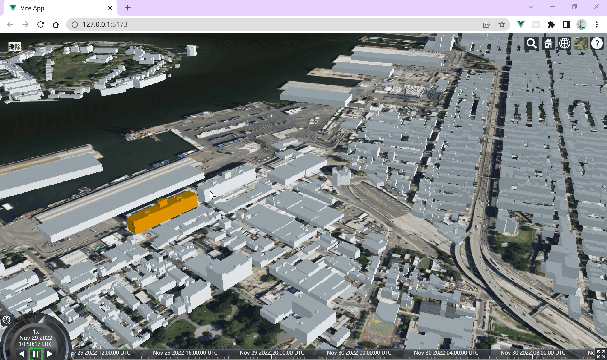

# 三维瓦片

## 3D Tiles

::: success 什么是 3D Tiles 数据？

[3D Tiles](https://flowus.cn/alikaid/58bca954-a100-4f1a-9c65-e30ee3e1034d) 实在 gltf 的基础上，加入了分层 LOD 的概念，专门为流式传输和渲染海量3D地理空间数据而设计的，例如倾斜摄影、3D建筑、BIM/CAD、实例化要素集、点云数据等。

它定义了一种数据分层结构和一组切片格式，用于渲染数据内容。3D Tils没有为数据的可视化定义明确的规范，客户可以按照自己合适的方式来可视化。

同时，3D Tiles也是 OGC服务 规范之一，可用于Web端、移动应用程序中对海量数据的渲染及交互功能。

:::


Cesium 支持通过 Entity 和 Primitive 两种方式加载 3D Tiles 数据，但是因为多数情况下 3D Tiles 数据都是成片区的数据，数据量比较大，所以为了保证性能，建议使用 Primitive 进行加载。

我们在 Cesium API 文档中搜索  3D Tiles 关键词，可以搜出如下结果：


- Cesium3DTile：数据集中的一个瓦片；
- Cesium3DTileContent：瓦片内容；
- Cesium3DTileFeature：瓦片要素集，用于访问 Tile 中批量表中的属性数据；
- Cesium3DTileset：用于流式传输大量的异构3D地理空间数据集；
- Cesium3DTileStyle：瓦片样式集；


在加载 [3D Tiles](https://cesium.com/learn/cesiumjs/ref-doc/Cesium3DTileset.html?classFilter=Cesium3DTileset) 数据之前，可以先到 [Cesium官网](https://ion.cesium.com/assets/69380?page=1&sortBy=DATE_ADDED&sortOrder=DESC) 添加 *墨尔本和纽约* 的在线数据。

1. 加载在线数据：

   ```js
   const tileset = viewer.scene.primitives.add(
     // 加载墨尔本建筑物3D Tiles
     await Cesium.Cesium3DTileset.fromIonAssetId(69380),
     // 加载纽约建筑物3D Tiles
     await Cesium.Cesium3DTileset.fromIonAssetId(75343),
     // 加载Google地球3D Tiles
     await Cesium.Cesium3DTileset.fromIonAssetId(2275207)
   );
   viewer.flyTo(tileset);
   ```

2. 加载离线数据，[详见参数配置](https://cesium.com/learn/cesiumjs/ref-doc/Cesium3DTileset.html#.ConstructorOptions)：

   ```js
   // 加载3D Tiles中 i3dm 文件
   const tileset = await Cesium.Cesium3DTileset.fromUrl(
     "/mars3d-max-shihua-3dtiles/tileset.json",
     {
       show: true,
       // 为摄像机或 CPU 拾取启用碰撞
       enableCollision: true,
       // 否使用其子边界体积的并集来剔除平铺
       cullWithChildrenBounds: true,
       // 设置基础屏幕空间误差，用于控制加载时的细节层次
       skipLevelOfDetail: true,
       immediatelyLoadDesiredLevelOfDetail: true,
       baseScreenSpaceError: 1024,
       skipScreenSpaceErrorFactor: 16,
       // 瓦片加载的屏幕空间误差，默认16，值越小精度越高，开销越大
       maximumScreenSpaceError: 32,
       // 启用动态屏幕空间误差，根据相机的速度调整瓦片加载策略
       dynamicScreenSpaceError: true,
       dynamicScreenSpaceErrorDensity: 0.002,
       dynamicScreenSpaceErrorFactor: 4,
       // 跳过中间级别瓦片，直接加载低分辨率瓦片以加快初始加载速度
       skipLevels: 2,
       // 当摄像机正在飞行时，在摄像机的飞行目的地预加载切片
       preloadFlightDestinations: true,
       // 优先加载叶子节点
       preferLeaves: true
     }
   )
   viewer.scene.primitives.add(tileset)
   viewer.flyTo(tileset)
   ```


## 模型贴地

添加完模型后如果漂浮在空中，可以使用下面的代码调整模型贴地：

```js
// 调整模型的高度偏移
const heightOffset = -70;
const boundingSphere = tileset.boundingSphere;
const cartographic = Cesium.Cartographic.fromCartesian(boundingSphere.center);
const surface = Cesium.Cartesian3.fromRadians(
  cartographic.longitude,
  cartographic.latitude,
  0.0
);
const offset = Cesium.Cartesian3.fromRadians(
  cartographic.longitude,
  cartographic.latitude,
  heightOffset
);
const translation = Cesium.Cartesian3.subtract(
  offset,
  surface,
  new Cesium.Cartesian3()
);

// 一个 4x4 转换矩阵，用于转换图块集的根图块
tileset.modelMatrix = Cesium.Matrix4.fromTranslation(translation);
```


## 样式插值

```js
// 加载纽约建筑物3D Tiles
const tileset = viewer.scene.primitives.add(
  await Cesium.Cesium3DTileset.fromIonAssetId(75343, {
    maximumScreenSpaceError: 2
  })
)
viewer.zoomTo(tileset)

const properties = tileset.properties
if (Cesium.defined(properties) && Cesium.defined(properties.Height)) {
  // 根据高度条件设置瓦片颜色
  tileset.style = new Cesium.Cesium3DTileStyle({
    color: {
      conditions: [
        ["${Height} >= 300", "rgba(45,0,75,0.9)"],
        ["${Height} >= 200", "rgba(102,71,151,0.9)"],
        ["${Height} >= 150", "rgba(170,162,204,0.9)"],
        ["${Height} >= 100", "rgba(224,226,238,0.9)"],
        ["${Height} >= 80", "rgba(252,230,200,0.9)"],
        ["${Height} >= 50", "rgba(248,176,87,0.9)"],
        ["${Height} >= 10", "rgba(198,106,11,0.9)"],
        ["true", "rgba(127, 59, 8,0.9)"]
      ]
    }
  })
}
```

::: success 拓展：什么是 Cesium.defined() 方法？

Cesium.defined() 方法是 Cesium 中专门用来判断传入的参数是否为 undefined 的函数。

- true：表示传入值不是 undefined；
- false：表示传入值是 undefined；

```js
if (Cesium.defined(feature)) {
  console.log("Feature is defined!");
} else {
  console.log("Feature is undefined!");
}
```

:::


## 获取模型属性信息

加载完 3D Tiles 信息之后，源数据中会存储一些属性信息，可以使用下面的方式获取到这些信息：

```js {16-18}
const tileset = viewer.scene.primitives.add(
  await Cesium.Cesium3DTileset.fromUrl(
    "/mars3d-max-shihua-3dtiles/tileset.json"
  )
)
viewer.zoomTo(tileset)

const handler = new Cesium.ScreenSpaceEventHandler(viewer.scene.canvas)
handler.setInputAction((e: any) => {
  const feature = viewer.scene.pick(e.position)
  if (Cesium.defined(feature) && feature instanceof Cesium.Cesium3DTileFeature) {
    const propertyObj: any = {}
    // 获取所有的属性信息的Key
    const propertys = feature.getPropertyIds()
    for (let i = 0; i < propertys.length; ++i) {
      const propertyName = propertys[i] // 属性名
      const propertyValue = feature.getProperty(propertyName) // 属性名
      propertyObj[propertyName] = propertyValue
    }
    console.log(propertyObj)
  }
}, Cesium.ScreenSpaceEventType.LEFT_CLICK)
```


## 拾取模型

鼠标滑过 3D Tiles 模型时，模型变为黄色，当鼠标移出时恢复原状：

1. 添加纽约市 3D Tiles 数据：


```js
const tileset = viewer.scene.primitives.add(
  // 加载纽约建筑物3D Tiles
  await Cesium.Cesium3DTileset.fromIonAssetId(75343)
);
viewer.zoomTo(tileset);
```

2. 添加鼠标移动事件：

```js
let pickModel:any;

const handler = new Cesium.ScreenSpaceEventHandler(viewer.scene.canvas);

handler.setInputAction((e: any) => {
  const pick = viewer.scene.pick(e.endPosition)
  // 如果没有拾取到对象或拾取到的对象与当前模型相同，直接返回
  // 避免鼠标在同一个模型移动时，重复为其设置颜色
  if (!Cesium.defined(pick) || pick === pickModel) {
    return
  }
  // 重置上一次拾取模型的颜色
  if (Cesium.defined(pickModel)) {
    pickModel.color = Cesium.Color.WHITE
  }
  pick.color = Cesium.Color.ORANGE
  pickModel = pick
}, Cesium.ScreenSpaceEventType.MOUSE_MOVE)
```



