# 基础实体绘制

Cesium 中空间数据可视化 API 共分为 2 部分：

- **Entity 实体**：它由 Primitive 图元封装组成，调用方便，但是加载大量数据时效率没有 Primitive 高；
- **Primitive 图元**：灵活性高，更接近 WebGL 的底层，没有像 Entity 一样带有附加属性，加载大量数据时效率更高；

> 参考博客：
>
> 1.  https://blog.csdn.net/appleshowc/article/details/123479194
> 2.  https://juejin.cn/post/6974592888420171790


## Point 点

点实体用于在三维空间中标记特定位置，始终以像素大小渲染，不受相机距离影响（除非设置了缩放属性）。

> [!CAUTION] 注意
>
> `id` 属性默认底层会进行赋值，如果手动赋值时，该值不允许重复，否则后续点无法绘制！

```javascript
const point = viewer.entities.add({
  id: "1",
  name: "point",
  show: true,
  position: Cesium.Cartesian3.fromDegrees(102.7362, 38.0249, 0),
  point: {
    show: true,
    pixelSize: 10,
    outlineWidth: 3,
    outlineColor: Cesium.Color.WHITE,
    color: Cesium.Color.fromCssColorString("#14858B").withAlpha(1),
    // 点的高度参考模式
    heightReference: Cesium.HeightReference.CLAMP_TO_GROUND,
    // 永远禁用深度检测
    disableDepthTestDistance: Number.POSITIVE_INFINITY,
    /**
      * 根据相机距离调整点大小
      * 参数：
      *  - near：距离相机的最近距离（米）
      *  - nearValue：当距离 <=near 时的属性值
      *  - far：距离相机的最远距离
      *  - farValue：当距离 >=far 时的属性值
      */
    scaleByDistance: new Cesium.NearFarScalar(1000, 2.0, 5000, 0.5),
    // 根据相机距离调整透明度（参数同上）
    translucencyByDistance: new Cesium.NearFarScalar(500, 1.0, 2000, 0.3),
    /**
      * 根据相机距离控制点是否显示
      * 参数：
      *  - near：可见范围的最小距离
      *  - far：可见范围的最大距离
      */
    distanceDisplayCondition: new Cesium.DistanceDisplayCondition(100, 3000),
  },
});

viewer.flyTo(point, {
  duration: 3.0,
  offset: new Cesium.HeadingPitchRange(0, -90, 1000),
});
```


## Polyline 线

```javascript
const polyline = viewer.entities.add({
  show: true,
  name: "polyline",
  polyline: {
    show: true,
    width: 5,
    // 是否贴合地表
    clampToGround: true,
    // 沿地球表面绘制
    arcType: Cesium.ArcType.GEODESIC,
    positions: Cesium.Cartesian3.fromDegreesArray([
      108.78240651340985,
      33.85352468106835,
      108.587982475937,
      33.90730799393394,
    ]),
    // 基础材质
    // material: new Cesium.ColorMaterialProperty(Cesium.Color.AQUAMARINE),
    material: Cesium.Color.fromCssColorString("#00ffff").withAlpha(0.8),
    // 根据距离控制折线的可见性
    distanceDisplayCondition: new Cesium.DistanceDisplayCondition(0, 10000),
    // 多条折线出现重叠时，该值越大，折线的显示优先级越高（仅在clampToGround为true时生效）
    zIndex: 1,
    // 折线的精细颗粒度，值越小，颗粒度越精细，渲染压力越大（一般不设置即可）
    // granularity: Cesium.Math.RADIANS_PER_DEGREE,
    // 是否接收投射阴影（没看到效果）
    // shadows: Cesium.ShadowMode.DISABLED,
  },
});

viewer.flyTo(polyline, {
  duration: 3.0,
  offset: new Cesium.HeadingPitchRange(0, -90, 100000),
});
```

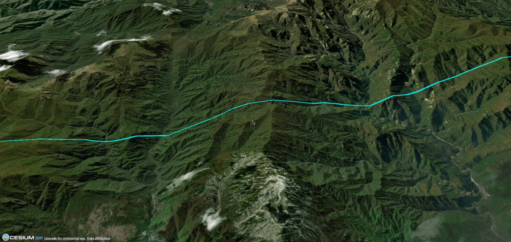


## Polygon 多边形

多边形实体用于创建封闭的二维区域，支持孔洞、拉伸高度和纹理映射等高级特性。

::: code-group

```javascript [基础多边形]
// 经纬度坐标数组
const positions = Cesium.Cartesian3.fromDegreesArray([110, 30, 110, 25, 115, 30]);
// 经纬度带高度的坐标数组，只在 perPositionHeight 为 true 时高度生效
// const positions = Cesium.Cartesian3.fromDegreesArrayHeights([
//   110, 30, 30000,
//   110, 25, 120000,
//   115, 30, 200000
// ]);

const polygon = viewer.entities.add({
  show: true,
  name: "polygon",
  polygon: {
    show: true,
    // 定义多边形的顶点位置
    hierarchy: {
      // 外部顶点
      positions: positions,
      // 内部带孔的顶点
      holes: [],
    },
    // 是否为每个顶点指定高度
    perPositionHeight: false,
    // 多边形按地球表面贴地绘制
    arcType: Cesium.ArcType.GEODESIC,
    // 多边形相对于椭球面的高度
    height: 0,
    // 指定高度是相对于什么而言的
    heightReference: Cesium.HeightReference.NONE,
    // 多边形的拉伸高度
    extrudedHeight: 100000,
    // 指定拉伸高度相对于什么而言的
    extrudedHeightReference: Cesium.HeightReference.NONE,
    // 是否闭合顶部
    closeTop: true,
    // 是否闭合底部
    closeBottom: true,
    // 多个多边形重合时，值越大多边形显示的越靠上
    zIndex: 1,
    // 多边形填充设置
    fill: true,
    material: Cesium.Color.YELLOW.withAlpha(0.5),
    // 纹理旋转角度（弧度制）
    // stRotation: Math.PI / 6,
    // 多边形轮廓设置
    outline: true,
    outlineWidth: 1,
    outlineColor: Cesium.Color.WHITE,
  },
});

viewer.zoomTo(polygon);
```

```javascript {16} [回型多边形]
// 外部顶点坐标
const outerPositions = Cesium.Cartesian3.fromDegreesArray([
  116.39, 39.9, 116.41, 39.9, 116.41, 39.92, 116.39, 39.92,
]);
// 内部孔洞左边
const innerPositions = Cesium.Cartesian3.fromDegreesArray([
  116.397, 39.907, 116.403, 39.907, 116.403, 39.913, 116.397, 39.913,
]);

const polygon = viewer.entities.add({
  show: true,
  name: "polygon",
  polygon: {
    show: true,
    // 定义多边形的顶点位置
    hierarchy: new Cesium.PolygonHierarchy(outerPositions, [new Cesium.PolygonHierarchy(innerPositions)]),
    // 是否为每个顶点指定高度
    perPositionHeight: false,
    // 多边形按地球表面贴地绘制
    arcType: Cesium.ArcType.GEODESIC,
    // 多边形相对于椭球面的高度
    height: 0,
    // 指定高度是相对于什么而言的
    heightReference: Cesium.HeightReference.NONE,
    // 多边形的拉伸高度
    extrudedHeight: 300,
    // 指定拉伸高度相对于什么而言的
    extrudedHeightReference: Cesium.HeightReference.NONE,
    // 是否闭合顶部
    closeTop: true,
    // 是否闭合底部
    closeBottom: true,
    // 多个多边形重合时，值越大多边形显示的越靠上
    zIndex: 1,
    // 多边形填充设置
    fill: true,
    material: Cesium.Color.YELLOW.withAlpha(0.5),
    // 纹理旋转角度（弧度制）
    // stRotation: Math.PI / 6,
    // 多边形轮廓设置
    outline: true,
    outlineWidth: 1,
    outlineColor: Cesium.Color.WHITE,
  },
});

viewer.zoomTo(polygon);
```

:::

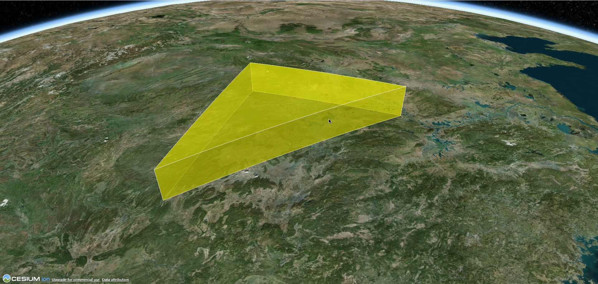


## PolylineVolume 多线段柱体

```javascript
async function addTerrainServer() {
  var redTube = viewer.entities.add({
    id: "polylineVolume",
    name: "polylineVolume",
    polylineVolume: {
      show: true,
      // 定义线带的 Cartesian3 位置的数组
      positions: Cesium.Cartesian3.fromDegreesArray([
        -85.0, 32.0, -85.0, 36.0, -89.0, 36.0
      ]),
      // 指定 Cartesian2 位置的数组，这些位置定义了要拉伸的形状
      shape: computeCircle(60000),
      cornerType: Cesium.CornerType.ROUNDED,
      fill: true,
      material: Cesium.Color.RED,
      outline: false,
      outlineColor: Cesium.Color.BLACK,
      outlineWidth: 1
    }
  });

  viewer.zoomTo(redTube);
}

function computeCircle(radius: number) {
  var positions = [];
  for (var i = 0; i < 360; i++) {
    var radians = Cesium.Math.toRadians(i);
    positions.push(
      new Cesium.Cartesian2(
        radius * Math.cos(radians),
        radius * Math.sin(radians)
      )
    );
  }
  return positions;
}
```
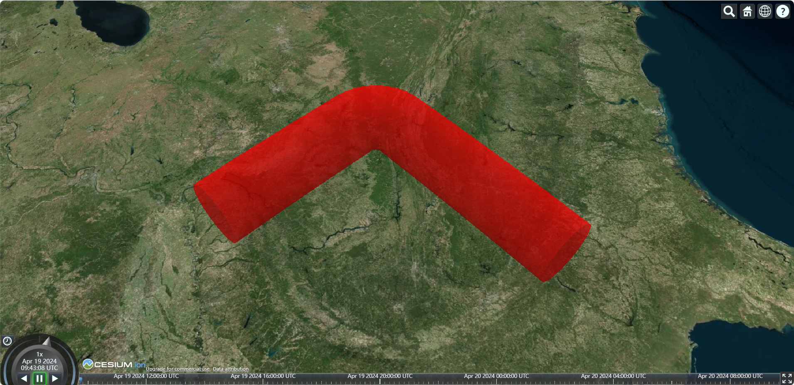


## Plane 平面

```javascript
const plane = viewer.entities.add({
  show: true,
  name: "plane",
  position: Cesium.Cartesian3.fromDegrees(116.39, 38.9, 0.0),
  plane: {
    show: true,
    // UNIT_Z 表示平面垂直于 Z 轴
    plane: new Cesium.Plane(Cesium.Cartesian3.UNIT_Z, 0.0),
    // 平面的长度和宽度
    dimensions: new Cesium.Cartesian2(100000, 100000),
    // 根据距离控制实体是否展示
    distanceDisplayCondition: new Cesium.DistanceDisplayCondition(0, 3000),
    // 平面填充
    fill: true,
    material: Cesium.Color.YELLOW.withAlpha(0.5),
    // material: "/cesium_stripes.png", // 可以指定图片作为填充
    outline: true,
    outlineWidth: 1,
    outlineColor: Cesium.Color.GREEN,
  },
});

viewer.zoomTo(plane);
```

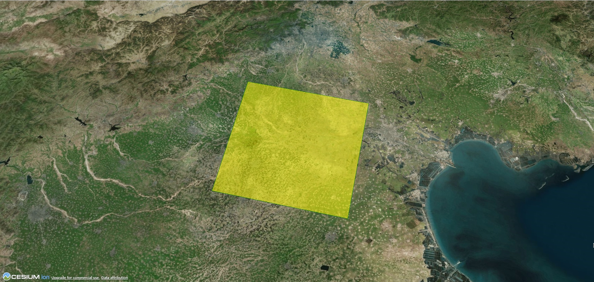


## Box 盒子

箱（Box）是 Cesium 中用于表示三维矩形的核心元素。它可以用于创建 3D 模型、表示物体的边界框、可视化数据等。

```javascript
const box = viewer.entities.add({
  show: true,
  name: "box",
  position: Cesium.Cartesian3.fromDegrees(102.7362, 38.0249, 0),
  box: {
    show: true,
    // 指定长宽高
    dimensions: new Cesium.Cartesian3(100000, 200000, 50000),
    // 指定高度是相对于什么的高度
    heightReference: Cesium.HeightReference.CLAMP_TO_GROUND,
    // 根据距离控制实体是否展示
    distanceDisplayCondition: new Cesium.DistanceDisplayCondition(0, 3000),
    fill: true,
    material: Cesium.Color.YELLOW.withAlpha(0.5),
    outline: true,
    outlineColor: Cesium.Color.WHITE,
    outlineWidth: 5,
  },
});

viewer.zoomTo(box);
```

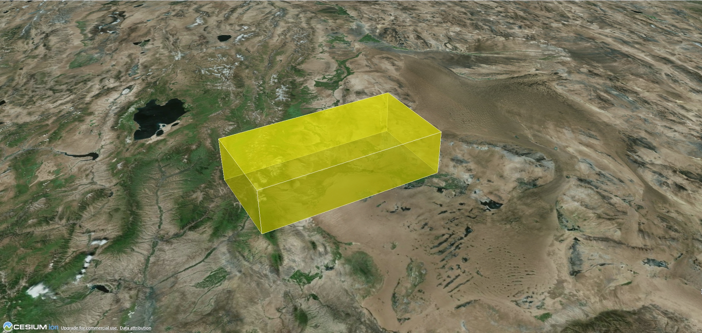


## Rectangle 矩形

```javascript
const rectangle = viewer.entities.add({
  show: true,
  name: "rectangle",
  position: Cesium.Cartesian3.fromDegrees(102.7362, 38.0249, 0),
  rectangle: {
    show: true,
    // 矩形的坐标（west, south, east, north）
    coordinates: Cesium.Rectangle.fromDegrees(116.3975, 39.9075, 116.4075, 39.9175),
    // 距离地面的高度
    height: 0,
    // 贴地显示
    heightReference: Cesium.HeightReference.CLAMP_TO_GROUND,
    // 拉伸高度
    extrudedHeight: 200,
    // 矩形旋转角度（正北, 顺时针旋转）
    rotation: Math.PI / 2,
    // 根据距离控制实体是否展示
    // distanceDisplayCondition: new Cesium.DistanceDisplayCondition(0, 3000),
    // 材质填充
    fill: true,
    material: Cesium.Color.YELLOW.withAlpha(0.5),
    // 纹理的旋转角度
    stRotation: Math.PI / 2,
    outline: true,
    outlineWidth: 1,
    outlineColor: Cesium.Color.WHITE,
  },
});

viewer.zoomTo(rectangle);
```

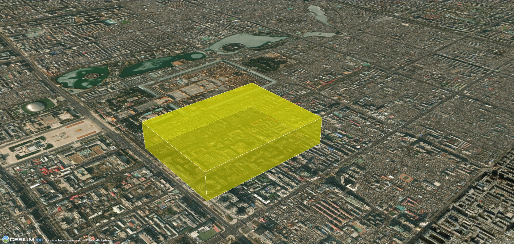


## Ellipse 椭圆

```js
const ellipse = viewer.entities.add({
  show: true,
  name: "ellipse",
  position: Cesium.Cartesian3.fromDegrees(116.3975, 39.9075, 0),
  ellipse: {
    show: true,
    semiMajorAxis: 100, 	// 长半轴
    semiMinorAxis: 100, 		// 短半轴
    height: 0,
    heightReference: Cesium.HeightReference.CLAMP_TO_GROUND,
    extrudedHeight: 100,
    extrudedHeightReference: Cesium.HeightReference.NONE,
    // 旋转角度（正北，逆时针旋转）
    rotation: Math.PI / 2,
    // 轮廓线垂直数量，值越大，轮廓线越多，椭圆越圆
    numberOfVerticalLines: 128,
    fill: true,
    material: Cesium.Color.YELLOW.withAlpha(0.5),
    // 纹理的旋转角度（弧度）
    stRotation: 0,
    outline: true,
    outlineWidth: 2,
    outlineColor: Cesium.Color.WHITE,
  },
});

viewer.zoomTo(ellipse);
```

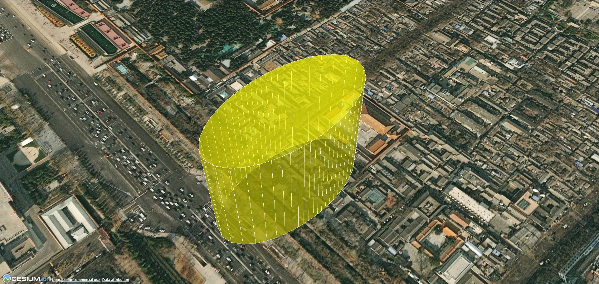


## Cylinder 圆柱/圆锥

圆柱本质上也是椭圆的一种情况，所以圆柱/圆锥也可以使用 椭圆 来绘制，只不过调整长半轴和短半轴相同而已。

```js
const cylinder = viewer.entities.add({
  show: true,
  name: "cylinder",
  position: Cesium.Cartesian3.fromDegrees(116.3975, 39.9075, 0),
  cylinder: {
    show: true,
    length: 30000, // 圆柱体长度
    topRadius: 10000, // 圆柱体顶部半径
    bottomRadius: 20000, // 圆柱体底部半径
    heightReference: Cesium.HeightReference.CLAMP_TO_GROUND,
    // 沿轮廓的周长绘制的垂直线的数量
    numberOfVerticalLines: 64,
    // 侧面切片数，默认128（如 4 的时候表示四棱台）
    slices: 128,
    fill: true,
    material: Cesium.Color.GREEN.withAlpha(0.5),
    outline: true,
    outlineWidth: 1,
    outlineColor: Cesium.Color.AQUA,
  },
});

viewer.zoomTo(cylinder);
```

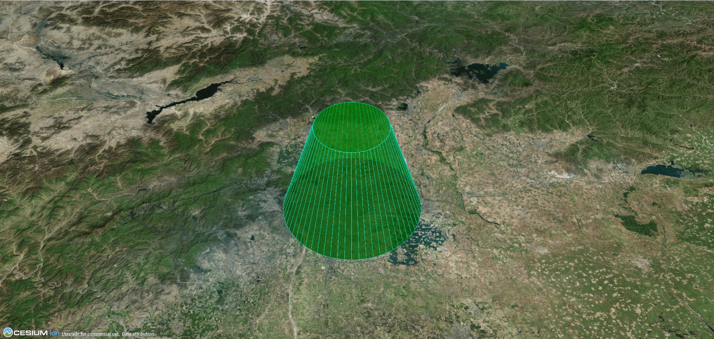


## Ellipsoid 椭球体

```js
const ellipsoid = viewer.entities.add({
  show: true,
  name: "ellipsoid",
  position: Cesium.Cartesian3.fromDegrees(116.3975, 39.9075, 0),
  ellipsoid: {
    show: true,
    // 椭球半径
    radii: new Cesium.Cartesian3(200000.0, 200000.0, 100000.0),
    minimumClock: 0.0, 			   // 最小时钟角度
    maximumClock: 2 * Math.PI, // 最大时钟角度
    minimumCone: 0.0, 			   // 最小圆锥角
    maximumCone: Math.PI, 		 // 最大圆锥角
    heightReference: Cesium.HeightReference.CLAMP_TO_GROUND,
    stackPartitions: 64, 		   // 延纬度线切割的次数
    slicePartitions: 64, 		   // 延经度线切割的次数
    subdivisions: 128, 			   // 每个轮廓环的样本数，确定曲率的粒度
    fill: true,
    material: Cesium.Color.YELLOW.withAlpha(0.5),
    outline: true,
    outlineWidth: 1.0,
    outlineColor: Cesium.Color.WHITE,
  },
});

viewer.zoomTo(ellipsoid);
```

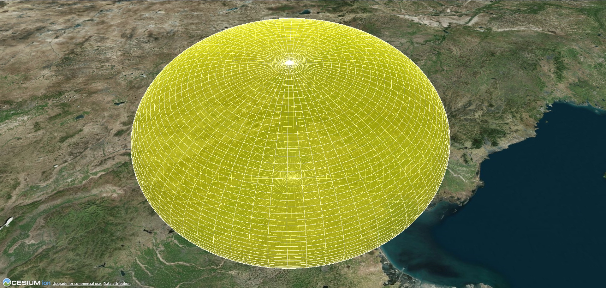


## Corridor 走廊

```js
const corridor = viewer.entities.add({
  show: true,
  name: "corridor",
  corridor: {
    show: true,
    positions: Cesium.Cartesian3.fromDegreesArray([
      -80.0, 40.0, -85.0, 40.0, -85.0, 35.0,
    ]),
    width: 200000,
    height: 200000,
    heightReference: Cesium.HeightReference.CLAMP_TO_GROUND,
    // 拉伸高度
    extrudedHeight: 100000,
    // 拉伸高度参考
    extrudedHeightReference: Cesium.HeightReference.NONE,
    // 拐角的类型
    cornerType: Cesium.CornerType.ROUNDED,
    // 每个纬度和经度之间的距离
    granularity: Cesium.Math.RADIANS_PER_DEGREE,
    // 是否对 地形 和 3D Tiles 进行分类
    classificationType: Cesium.ClassificationType.BOTH,
    fill: true,
    material: Cesium.Color.SKYBLUE.withAlpha(0.5),
    outline: true,
    outlineWidth: 1,
    outlineColor: Cesium.Color.WHITE,
  },
});

viewer.zoomTo(corridor);
```
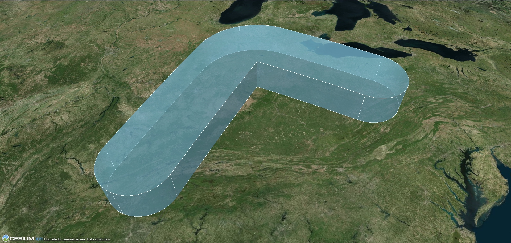


## Wall 墙

```js
const wall = viewer.entities.add({
  show: true,
  name: "wall",
  wall: {
    show: true,
    positions: Cesium.Cartesian3.fromDegreesArrayHeights([
      116.3975, 39.9075, 300, 116.4075, 39.9075, 300, 116.4075, 39.9175, 300,
      116.3975, 39.9175, 300, 116.3975, 39.9075, 300,
    ]),
    // 每个顶点的最小高度
    minimumHeights: [0, 0, 0, 0, 0],
    // 每个顶点的最大高度
    maximumHeights: [300, 300, 300, 300, 300],
    fill: true,
    material: Cesium.Color.GREENYELLOW.withAlpha(0.8),
    outline: false,
    outlineWidth: 1.0,
    outlineColor: Cesium.Color.BLACK,
  },
});

viewer.zoomTo(wall);
```

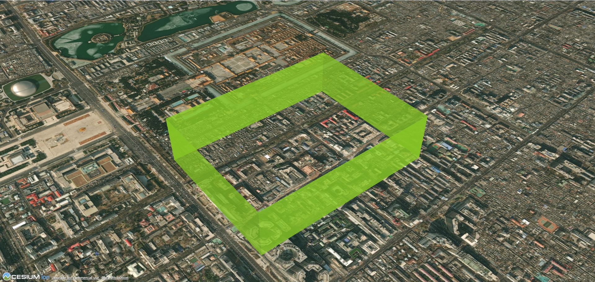


## Label 标签

```js
const label = viewer.entities.add({
  position: Cesium.Cartesian3.fromDegrees(102.7362, 38.0249, 0),
  label: {
    text: "home of my love",
    font: "26px sans-serif",
    scale: 1,
    style: Cesium.LabelStyle.FILL_AND_OUTLINE, 			// 设置该属性背景和外边线才会显示
    fillColor: Cesium.Color.fromCssColorString("#22385b"),
    outlineColor: Cesium.Color.fromCssColorString("#fff"),
    outlineWidth: 3,
    showBackground: false, 								// 是否显示背景颜色
    backgroundColor: new Cesium.Color(112, 86, 151), 	// 背景颜色
    backgroundPadding: new Cesium.Cartesian2(50, 50), 	// 背景 padding
    horizontalOrigin: Cesium.HorizontalOrigin.CENTER, 	// 水平居中
    verticalOrigin: Cesium.VerticalOrigin.CENTER, 		// 垂直居中
    pixelOffset: new Cesium.Cartesian2(0, -40) 			// 偏移
  }
});

viewer.zoomTo(label);
```


## Billboard 广告牌

广告牌使用 [`new Cesium.Billboard()`](https://cesium.com/learn/cesiumjs/ref-doc/Billboard.html?classFilter=billboard) 来创建。

```js
const enetity = viewer.entities.add({
  name: "billboard",
  position: Cesium.Cartesian3.fromDegrees(113.122717, 23.028762, 10),
  label: {
    text: "航路点",
    font: "bold 26px sans-serif",
    scale: 0.5,
    style: Cesium.LabelStyle.FILL_AND_OUTLINE,
    fillColor: Cesium.Color.fromCssColorString("#22385b"),
    outlineColor: Cesium.Color.fromCssColorString("#fff"),
    outlineWidth: 4,
    pixelOffset: new Cesium.Cartesian2(0, -40),
    showBackground: false,
    backgroundColor: Cesium.Color.WHITE.withAlpha(0.2),
    backgroundPadding: new Cesium.Cartesian2(20, 10),
    heightReference: Cesium.HeightReference.NONE
  },
  billboard: {
    image: "/位置.png",
    horizontalOrigin: Cesium.HorizontalOrigin.CENTER,
    verticalOrigin: Cesium.VerticalOrigin.BOTTOM,
    scale: 0.5,
    width: 50,
    height: 50,
    pixelOffset: new Cesium.Cartesian2(0, -50), 	  	// 像素偏移
    eyeOffset: new Cesium.Cartesian3(0, 0, 0), 	  		// 眼睛偏移
    heightReference: Cesium.HeightReference.NONE,  		// 高度参考
    color: Cesium.Color.LIME,
    rotation: Cesium.Math.PI_OVER_FOUR,            		// 旋转角度(弧度)
    alignedAxis: Cesium.Cartesian3.ZERO,           		// 世界空间中的对齐轴
    // 根据广告牌与相机的距离获取或设置广告牌的近和远缩放属性
    scaleByDistance: new Cesium.NearFarScalar(1.0e3, 2.0, 2.0e3, 1.0),
    // 根据广告牌到相机的距离，获取或设置广告牌的近和远半透明属性
    translucencyByDistance: new Cesium.NearFarScalar(1.0e3, 1.0, 1.5e6, 0.5),
    // 根据广告牌与摄像头的距离，获取或设置广告牌的近像素偏移量和远像素偏移量缩放属性
    pixelOffsetScaleByDistance: new Cesium.NearFarScalar(1.0e3, 1.0, 1.5e6, 0.5), 
    // 设置10000米和30000米之间可见
    distanceDisplayCondition: new Cesium.DistanceDisplayCondition(10000, 30000),
  }
});

viewer.zoomTo(enetity);
```
