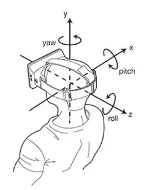

# 相机视角

相机视角主要用于控制相机的飞行定位，例如系统初始化位置定位、视点切换、设备定位、报警事件定位等，这些都是通过对相机进行操作实现的。

Cesium 虽然提供了很多种方法用于实现相机的飞行定位，但这些方法都是 **基于 Viewer 和 Camera 类实现的**。


## 相机参数

在 Cesium 中，我们要想确定相机视角，需要设置相机的两个参数：

- **位置**（destination）

  ```typescript
  // 笛卡尔坐标位置
  const cartesian = Cesium.Cartesian3.fromDegrees(longitude, latitude, height);
  ```

  

- **方向**（orientation）

  ```typescript
  // viewer 定位使用
  const orientation = new Cesium.HeadingPitchRange(heading, pitch, range);
  
  // viewer.camera 定位使用
  const orientation = {
    heading: Cesium.Math.toRadians(0),
    pitch: Cesium.Math.toRadians(-90),
    roll: Cesium.Math.toRadians(0)
  }
  ```
  
  
  
  |  参数   |                描述                | 默认值 |
  | :-----: | :--------------------------------- | :----: |
  | heading |          偏航角，正北为 0           |   0    |
  |  pitch  |         俯仰角，俯视为-90          |  -90   |
  |  roll   |               翻滚角               |   0    |
  |  range  | 范围（米），代表相机距离目标的高度 | - |




## viewer 定位

在 Viewer 类中有两个方法用于实现飞行定位：

|  方法  |            描述            | 是否有动画 |
| :----: | :------------------------: | :--------: |
| flyTo  | 视角带有动画地飞行到位置点 |     有     |
| zoomTo | 视角直接跳转到数据源的位置 |     无     |

> [!TIP] 适用场景
>
> 1. 适用于飞行定位到某个具体的对象，如 Entity、Primitive、DataSource 等；
>
> 2. Cesium 内部会自动计算合适的视角，让目标对象在屏幕上完全可见；
>
>    ```typescript
>    // 飞行到所有实体对象，使它们全部可见
>    viewer.flyTo(viewer.entities);
>    ```
>

::: code-group

```typescript [flyTo] {18-22}
const rectangle = viewer.entities.add({
  id: 'rectangle',
  name: 'rectangle',
  show: true,
  rectangle: {
    coordinates: Cesium.Rectangle.fromDegrees(102.7357, 38.025, 102.737, 38.0258),
    material: Cesium.Color.GREEN.withAlpha(0.8),
    height: 10.0,
    outline: false
  }
});

const heading = Cesium.Math.toRadians(0);
const pitch = Cesium.Math.toRadians(-90);
const range = 1000; // 视角距离实体的垂直高度

// 飞行定位到 Entity 实体位置
await viewer.flyTo(rectangle, {
  duration: 3.0,
  maximumHeight: 2000, // 飞行时视角的最大高度
  offset: new Cesium.HeadingPitchRange(heading, pitch, range)
});
```

```typescript [zoomTo] {14-18}
const rectangle = viewer.entities.add({
  id: 'rectangle',
  name: 'rectangle',
  show: true,
  rectangle: {
    coordinates: Cesium.Rectangle.fromDegrees(102.7357, 38.025, 102.737, 38.0258),
    material: Cesium.Color.GREEN.withAlpha(0.8),
    height: 10.0,
    outline: false
  }
});

// 视角跳转到 Entity 实体位置
await viewer.zoomTo(rectangle, {
  heading: Cesium.Math.toRadians(0),
  pitch: Cesium.Math.toRadians(-90),
  range: 1000 // 距离中心点的高度
});
```

:::


## camera 定位

Camera 类对应的相机定位方法比较多，包括了如下四个方法：

|        方法         | 描述                                             | 是否有动画 |
| :-----------------: | :----------------------------------------------- | :--------: |
|        flyTo        | 相机带动画地飞行到位置点                         |     有     |
|       lookAt        | 相机跳转到指定位置点（视角可以旋转，但无法拖动） |     无     |
|       setView       | 相机跳转到指定位置点                             |     无     |
| flyToBoundingSphere | 将相机平滑的移动到指定的范围                     |     有     |

::: code-group

```typescript [flyTo]
const point = Cesium.Cartesian3.fromDegrees(102.7357, 38.025, 200);
const rectangle = Cesium.Rectangle.fromDegrees(102.7357, 38.025, 102.737, 38.0258);

viewer.camera.flyTo({
  destination: point, // 飞行定位点，可以是 Cartesian3坐标点 或 Rectangle矩形等
  orientation: {
    heading: Cesium.Math.toRadians(0),
    pitch: Cesium.Math.toRadians(-90),
    roll: Cesium.Math.toRadians(0)
  },
  duration: 3.0,
  maximumHeight: 2000,
});
```

```typescript [setView]
const point = Cesium.Cartesian3.fromDegrees(102.7357, 38.025, 200);
const rectangle = Cesium.Rectangle.fromDegrees(102.7357, 38.025, 102.737, 38.0258);

viewer.camera.setView({
  destination: point,
  orientation: {
    heading: Cesium.Math.toRadians(0),
    pitch: Cesium.Math.toRadians(-90),
    roll: Cesium.Math.toRadians(0)
  }
});
```

```typescript [lookAt]
const point = Cesium.Cartesian3.fromDegrees(102.7357, 38.025, 200);

const heading = Cesium.Math.toRadians(0);
const pitch = Cesium.Math.toRadians(-90);
const range = 1000;
const handingPitchRange = new Cesium.HeadingPitchRange(heading, pitch, range);

// lookAt() 的目的地只能是 Cartesian3 坐标
viewer.camera.lookAt(point, handingPitchRange);
```

```typescript [flyToBoundingSphere]
const center = Cesium.Cartesian3.fromDegrees(102.7357, 38.025, 200);
const radius = 500;
const boundingSphere = new Cesium.BoundingSphere(center, radius); // 创建包围球对象

viewer.camera.flyToBoundingSphere(boundingSphere, {
  duration: 3.0,
  maximumHeight: 2000,
  offset: new Cesium.HeadingPitchRange(
    Cesium.Math.toRadians(0),
    Cesium.Math.toRadians(-90),
    1000
  )
});
```

:::


## 二者对比

|   属性   |                  Viewer 定位                   |        Camera 定位         |
| :------: | :--------------------------------------------: | :------------------------: |
|   作用   |             Cesium 总的场景控制器              |     只控制视角和观察点     |
| 常用功能 |            管理 Scene、图层、实体等            | 控制相机移动、旋转、缩放等 |
| 控制重点 |                    整个场景                    |           摄像机           |
| 生活举例 | 整个电影院（包含大荧幕、灯光、座椅、投影仪等） |         只是投影仪         |
