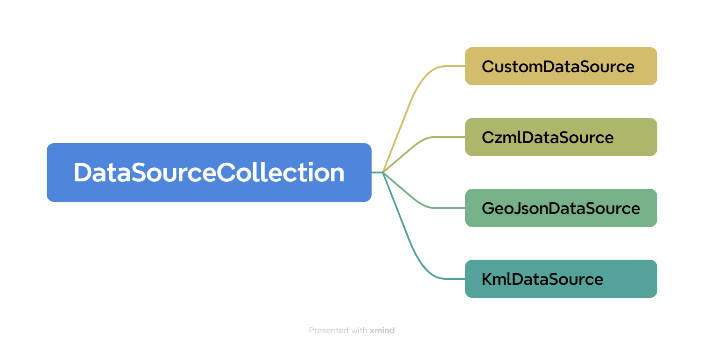
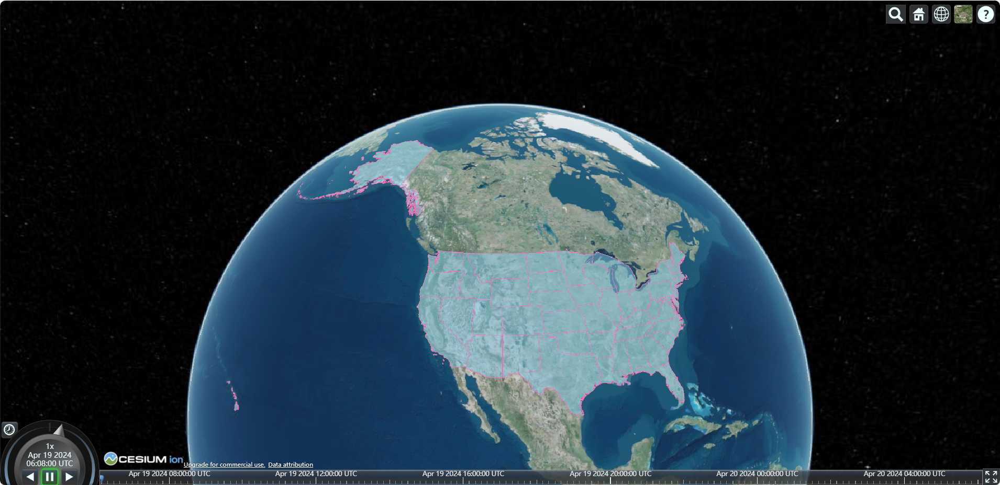
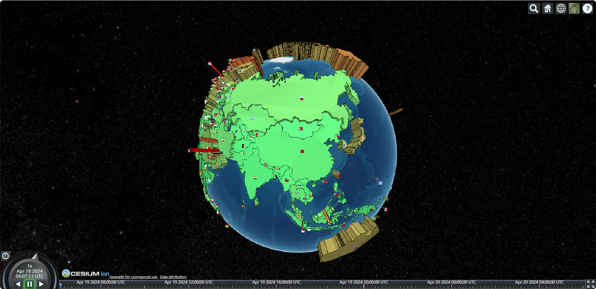

# 矢量数据

矢量数据是用 X、Y、Z 坐标表示地图图形或地理实体位置的数据，常见的矢量数据有：点、线、面等格式。

> [!TIP]  适量数据的优点
>
> - 数据结构紧凑，冗余度低；
> - 有利于网络检索和分析；
> - 图形显示质量好、精度高，不会失真；


Cesium 直接支持的矢量数据格式包括 geojson、topojson、kml 及具有时间特性的 czml，它们都以 DataSource 后缀去命名相关的类。




## GeoJSON

> [!NOTE] 什么是 GeoJSON 数据？
>
> [GeoJSON](https://geojson.cn/docs/ref/geojson) 数据是用于 **描述地理空间信息的数据格式**，其语法符合 JSON 规范，被专门用于表示地理信息。

Cesium 中使用 [`Cesium.GeoJsonDataSource.load()`](https://cesium.com/learn/cesiumjs/ref-doc/GeoJsonDataSource.html?classFilter=GeoJsonDataSource) 方法加载 GeoJSON 数据，该方法的返回值是一个 Promise 对象。

::: info 提示

`viewer.dataSources.add()` 方法正好可以接收一个 Promise 作为参数使用，因此可以将 Cesium.GeoJsonDataSource.load() 方法的返回值作为 参数 传递。

:::


::: code-group

```typescript [加载GeoJSON]
/**
 * 加载 GeoJSON 格式数据
 * @param geoJson GeoJSON数据
 * @example
 * ``` js
 * const options: any = { steps: 128, units: "kilometers", properties: { foo: "bar" } };
 * const circle = turf.circle([114, 30], 100, options);
 * await loadGeoJson(circle);
 * ```
 */
export async function loadGeoJson(geoJson) {
  const dataSource = await Cesium.GeoJsonDataSource.load(geoJson, {
    // 外边线颜色
    stroke: Cesium.Color.RED,
    // 外边线宽度（Cesium加载GeoJSON数据时，用到了WebGL相关的手段，线宽可能会被默认加载为1px）
    strokeWidth: 1,
    // 面填充色
    fill: Cesium.Color.YELLOW.withAlpha(0.5),
    // 面是否贴地（开启此属性时，strokeWidth将会失效）
    clampToGround: true,
  });
  // 设置数据源名称，移除数据时使用
  dataSource.name = "GeoJSON";
  window.viewer.dataSources.add(dataSource);
}
```


```typescript [移除GeoJSON]
/**
 * 移除 GeoJSON 格式数据
 * @param {string} name 数据源名称
 */
export function removeGeoJson(name: string | string[]) {
  const names = Array.isArray(name) ? name : [name];
  const dataSources = window.viewer.dataSources._dataSources;
  for (let i = dataSources.length - 1; i >= 0; i--) {
    if (names.includes(dataSources[i].name)) {
      window.viewer.dataSources.remove(dataSources[i]);
    }
  }
}
```

```typescript [显隐GeoJSON]
/**
 * 切换 GeoJSON 图层显隐
 * @param {string} name 数据源名称
 * @param {boolean} state 显隐状态
 */
export function toggleVisible(name: string, state: boolean) {
  const dataSources = window.viewer.dataSources._dataSources;
  for (let i = dataSources.length - 1; i >= 0; i--) {
    const dataSource = dataSources[i];
    if (dataSource.name === name) {
      dataSource.show = state;
    }
  }
}
```

:::


## TopJSON

> [!NOTE] 什么是 TopJSON 数据？
>
> [TopJSON](https://github.com/topojson/topojson-specification?tab=readme-ov-file#11-examples) 是 GeoJSON 按拓扑学编码后的扩展形式，相比于 GeoJSON 直接使用 Polygon、Point 等几何体来表示图形的方法，TopJSON 中每个几何体都是通过 **共享边** 后整合组成的，因此 TopJSON 降低了冗余，缩小了近 80%的文件大小。
>
> 

加载 TopJSON 数据也使用 [`Cesium.GeoJsonDataSource.load()`](https://cesium.com/learn/cesiumjs/ref-doc/GeoJsonDataSource.html?classFilter=GeoJsonDataSource) 方法，官方提供的 TopJSON 数据可 [查看此处](https://github.com/CesiumGS/cesium/tree/main/Apps/SampleData)，也可以通过 [转换工具](https://jeffpaine.github.io/geojson-topojson/) 将 GeoJSON 转换为 TopJSON 再进行加载。

```typescript
/**
 * 加载 TopJSON 格式数据
 * @param {string} url 数据地址
 * @example
 * ``` js
 * await loadTopJson("/data/ne_10m_us_states.topojson");
 * ```
 */
export async function loadTopJson(url: string) {
  const dataSource = await Cesium.GeoJsonDataSource.load(url, {
    // 外边线颜色
    stroke: Cesium.Color.RED,
    // 外边线宽度（Cesium加载GeoJSON数据时，用到了WebGL相关的手段，线宽可能会被默认加载为1px）
    strokeWidth: 1,
    // 面填充色
    fill: Cesium.Color.YELLOW.withAlpha(0.5),
    // 面是否贴地（开启此属性时，strokeWidth将会失效）
    clampToGround: true,
  });
  dataSource.name = "TopJson";
  window.viewer.dataSources.add(dataSource);
}
```




## kml 和 kmz

> [!NOTE] 什么是 kml 和 kmz 数据？
>
> kml 是一种基于 xml 语法格式的文件，用来描述和存储地理信息数据（如点、线、面、多边形、多边体等）。
>
> kml 文件有两个文件扩展名 `.kml` 和 `.kmz`，二者区别如下：
>
> - kml 是解压缩文件，而 kmz 是 kml 文件的压缩版本；
>
> - kml 有更大的文件空间和更长的数据传输，而 kmz 作为压缩文件具有较小的文件空间和大小；

Cesium 中使用 [`Cesium.KmlDataSource.load()`](https://cesium.com/learn/cesiumjs/ref-doc/KmlDataSource.html?classFilter=KmlDataSource) 加载 kml 和 kmz 数据，官方提供的 kml 和 kmz 数据可 [查看此处](https://github.com/CesiumGS/cesium/tree/main/Apps/SampleData/kml)。

```js
/**
 * 加载 kml 或 kmz 格式数据
 * @param {string} url 数据地址
 * @example
 * ``` js
 * await loadKmlData("/data/gdpPerCapita2008.kmz");
 * ```
 */
export async function loadKmlData(url: string) {
  const dataSource = await Cesium.KmlDataSource.load(url, {
    camera: window.viewer.scene.camera,
    canvas: window.viewer.scene.canvas,
  });
  dataSource.name = "KmlData";
  window.viewer.dataSources.add(dataSource);
}
```




## czml

> [!NOTE] 什么是 czml 数据？
>
> czml 本质上就是一个 JSON 格式的字符串，用于 **描述模型和时间之间的动画场景**，czml 包含点、线、地标、模型等图形元素，**指明了这些元素如何随着时间而变化**。

在 Cesium 中使用 [`Cesium.CzmlDataSource.load()`](https://cesium.com/learn/cesiumjs/ref-doc/CzmlDataSource.html?classFilter=CzmlDataSource) 加载 czml 数据，官方提供的 czml 数据可 [查看此处](https://github.com/CesiumGS/cesium/tree/main/Apps/SampleData)。

```typescript
const viewer = new Cesium.Viewer("cesium-container", {
  // 启用时钟动画
  animation: true,
  shouldAnimate: true,
});

/**
 * 加载 czml 格式数据
 * @param {string} url 数据地址
 * @example
 * ``` js
 * await loadCzmlData("/data/MultipartVehicle_part1.czml");
 * ```
 */
export async function loadCzmlData(url: string) {
  // czml 数据源的 name 属性，默认就是 url 的文件名称
  const dataSource = await Cesium.CzmlDataSource.load(url);
  window.viewer.dataSources.add(dataSource);
}
```
