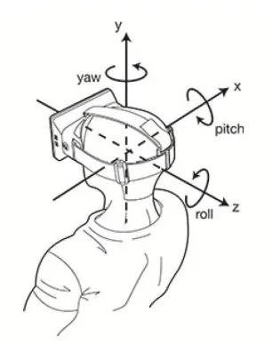

# 相机视角

相机视角主要用于控制相机的飞行定位，例如系统初始化位置定位、视点切换、设备定位、报警事件定位等，这些都是通过对相机进行操作实现的。

Cesium 虽然提供了很多种方法用于实现相机的飞行定位，但这些方法都是 **基于 Viewer 和 Camera 类实现的**。


## 相机参数

在 Cesium 中，我们要想确定相机视角，需要设置相机的两个参数：

- 位置（destination）

- 方向（orientation）

  |  参数   |                描述                | 默认值 |
  | :-----: | :--------------------------------: | :----: |
  | heading |          偏航角，正北为 0           |   0    |
  |  pitch  |         俯仰角，俯视为-90          |  -90   |
  |  roll   |               翻滚角               |   0    |
  |  range  | 范围（米），代表相机距离目标的高度 |        |




## Viewer类

在 Viewer 类中有两个方法用于实现飞行定位：

|  方法  |            描述            | 是否有动画 |
| :----: | :------------------------: | :--------: |
| flyTo  | 视角带有动画地切换到位置点 |     有     |
| zoomTo | 视角直接跳转到数据源的位置 |     无     |

::: tip 使用场景

1. 适用于导航到某个具体的对象，如 Entity、Primitive、DataSource 等；

2. Cesium 内部会自动计算合适的视角，让目标对象在屏幕上完全可见；

   ```ts
   // 飞行到所有实体对象，使它们全部可见
   viewer.flyTo(viewer.entities);
   ```

:::

::: code-group

```typescript [flyTo方法] {15-19}
const rectangle = viewer.entities.add({
  rectangle: {
    coordinates: Cesium.Rectangle.fromDegrees(102.7357, 38.025, 102.737, 38.0258),
    material: Cesium.Color.GREEN.withAlpha(0.8),
    height: 10.0,
    outline: false
  }
});

const heading = Cesium.Math.toRadians(0);
const pitch = Cesium.Math.toRadians(-90);
const range = 1000; // 视角距离实体的垂直高度

// 飞行到绘制的 entity 实体
await viewer.flyTo(rectangle, {
  duration: 3.0,
  maximumHeight: 2000, // 飞行时视角的最大高度
  offset: new Cesium.HeadingPitchRange(heading, pitch, range)
});
```

```typescript [zoomTo方法] {11-15}
const rectangle = viewer.entities.add({
  rectangle: {
    coordinates: Cesium.Rectangle.fromDegrees(102.7357, 38.025, 102.737, 38.0258),
    material: Cesium.Color.GREEN.withAlpha(0.8),
    height: 10.0,
    outline: false
  }
});

// 视角直接跳转到 entity 实体
await viewer.zoomTo(rectangle, {
  heading: Cesium.Math.toRadians(0),
  pitch: Cesium.Math.toRadians(-90),
  range: 1000 // 距离中心点的高度
});
```

:::


## Camera类

Camera 类对应的相机定位方法比较多，包括了如下四个方法：

|        方法         | 描述                                             | 是否有动画 |
| :-----------------: | :----------------------------------------------- | :--------: |
|        flyTo        | 相机带有动画的切换到位置点                       |     有     |
|       lookAt        | 相机跳转到指定位置点（视角可以旋转，但不能拖动） |     无     |
|       setView       | 相机跳转到指定位置点                             |     无     |
| flyToBoundingSphere | 将相机平滑的移动到指定的范围                     |     有     |

::: code-group

```ts [flyTo方法]
const rectangle = Cesium.Rectangle.fromDegrees(102.7357, 38.025, 102.737, 38.0258);
const point = Cesium.Cartesian3.fromDegrees(102.7357, 38.025, 200);

// 将相机设置到指定的目的地
viewer.camera.flyTo({
  destination: rectangle, // 目的地对象，可以是 Cartesian3点 或 Rectangle矩形范围
  orientation: {
    heading: Cesium.Math.toRadians(0),
    pitch: Cesium.Math.toRadians(-90),
    roll: Cesium.Math.toRadians(0)
  },
  duration: 3.0,
  maximumHeight: 2000, // 相机飞行时的最大高度
});
```

```ts [setView方法]
const rectangle = Cesium.Rectangle.fromDegrees(102.7357, 38.025, 102.737, 38.0258);
const point = Cesium.Cartesian3.fromDegrees(102.7357, 38.025, 200);

// 直接跳转到目的地，没有飞行动画
viewer.camera.setView({
  destination: point, // 目的地对象，可以是 Cartesian3点 或 Rectangle矩形范围
  orientation: {
    heading: Cesium.Math.toRadians(0),
    pitch: Cesium.Math.toRadians(-90),
    roll: Cesium.Math.toRadians(0)
  }
});
```

```ts [lookAt方法] {10}
const point = Cesium.Cartesian3.fromDegrees(102.7357, 38.025, 200);

const heading = Cesium.Math.toRadians(0);
const pitch = Cesium.Math.toRadians(-90);
const range = 1000;
const handingPitchRange = new Cesium.HeadingPitchRange(heading, pitch, range);

// 将视角固定在目的地，可以旋转，但不能拖动位置
// lookAt的目的地只能是 Cartesian3 点
viewer.camera.lookAt(point, handingPitchRange);
```

```ts [flyToBoundingSphere]
const center = Cesium.Cartesian3.fromDegrees(102.7357, 38.025, 200);
const radius = 500;
const boundingSphere = new Cesium.BoundingSphere(center, radius); // 创建包围球对象

// 将相机定位到包围球的位置
viewer.camera.flyToBoundingSphere(boundingSphere, {
  duration: 3.0,
  maximumHeight: 2000,
  offset: new Cesium.HeadingPitchRange(
    Cesium.Math.toRadians(0),
    Cesium.Math.toRadians(-90),
    1000
  )
});
```

:::


## 对比

|   属性   |                     Viewer                     |           Camera           |
| :------: | :--------------------------------------------: | :------------------------: |
|   作用   |             Cesium 总的场景控制器              |     只控制视角和观察点     |
| 常用功能 |            管理Scene、图层、实体等             | 控制相机移动、旋转、缩放等 |
| 控制重点 |                    整个场景                    |           摄像机           |
| 生活举例 | 整个电影院（包含大荧幕、灯光、座椅、投影仪等） |         只是投影仪         |
