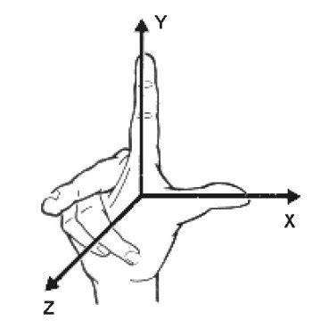
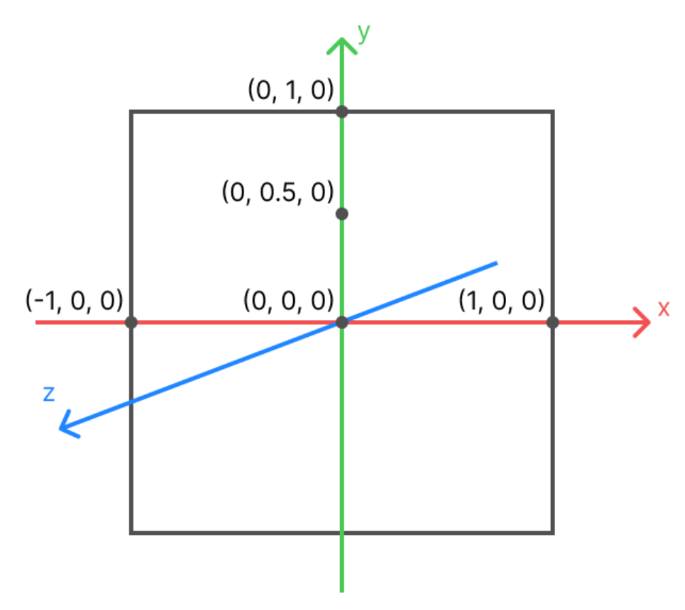

# 什么是 WebGL？

WebGL 是一种 JavaScript API，它允许在网页浏览器中通过 HTML 的 `<canvas>` 标签呈现 3D 和 2D 图形。

> [!NOTE] WebGL、OpenGL 和 Three.js 的区别？
>
> - OpenGL 是一套跨平台的图形渲染 API，通常用于开发高性能图形应用程序；
> - WebGL 是 OpenGL ES 的一个实现，是专门为了在浏览器环境中进行图形渲染而设计的；
> - Three.js 是基于 WebGL 进行封装后，提供更高级的 API 来简化 3D 图形的创建和渲染；

## WebGL 坐标系

WebGL 默认使用的是  **笛卡尔坐标系**  的 **右手坐标系**，满足右手法则。即 X 轴向右，Y 轴向上，Z 轴面向观察者，原点位于画布中心。

需要特殊注意的是坐标值，它使用的是  **百分比** 。比如 X 轴的取值范围是 `[-1, 1]`， `-1` 表示在屏幕的最左侧，`1` 表示在屏幕左右侧。

## 渲染管线

下面这张图展示了在 WebGL 中图形渲染过程的流程图：

**顶点缓冲区：** 在图形缓冲区存储了所有顶点数据，如 顶点的位置、颜色、法向量等。顶点数据是渲染过程中的基本输入。

**顶点着色器：** 顶点缓冲区的数据传递给 “顶点着色器” 进行处理。顶点着色器主要负责对每个顶点数据进行计算处理（如变换矩阵应用、光照计算等）。

**图元装配：** 处理后的顶点数据会送到 “图元装配” 阶段，图元装配的任务是将顶点数据组合成图形基本单元（如三角形、线段等）。

**光栅器：** 图元装配后的数据会送到 “光栅器” 模块，这一部分负责进行光照和光线追踪等计算，确定物体表面的光照和颜色变化。

**片元着色器：** 片元着色器会对每个片元像素进行颜色和纹理的计算，通过使用来自顶点着色器和光照计算的结果，生成最终像素颜色。

**Uniform 数据：** Uniform 数据是在渲染过程中的一些全局常量，这些常量不会随着每个顶点或片元的变化而变化。

**归属测试：** 通常用于确定片元是否属于特定的区域或者区域的可见性。

**模板测试：** 用于进行更复杂的像素过滤，可以帮助实现效果，如裁剪、遮罩等。

**深度测试：** 用于判断一个片元是否应该被绘制，基于深度缓冲区的内容来进行比较，确保物体的正确显示顺序。

**融合：** 融合阶段会把经过处理后的片元数据与其他渲染内容合成最终的图像输出。
