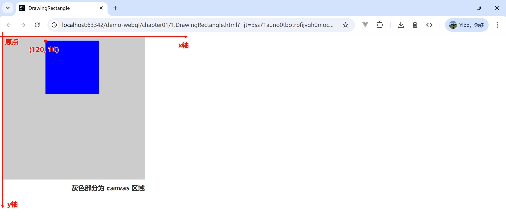
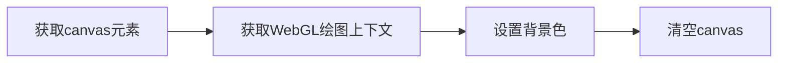

# canvas 基础

## canvas 是什么

`<canvas>` 标签定义了网页上的绘图区域，让我们可以通过 Javascript 绘制任何想画的东西。

> [!IMPORTANT] canvas 坐标系统
>
> `<canvas>` 的坐标系统 <span class="marker-text-highlight"> 横轴为 x 轴（正方向朝右），纵轴为 y 轴（正方向朝下），原点落在左上方 </span>。

```html
<!DOCTYPE html>
<html lang="en">
  <head>
    <meta charset="UTF-8">
    <title>DrawingRectangle</title>
    <style>
      #example {
        background-color: #ccc;
      }
    </style>
  </head>
  <body>
    <canvas id="example" width="400" height="400">
      请使用支持 canvas 的浏览器查看
    </canvas>

    <script>
      const canvas = document.getElementById("example");
      if (!canvas) {
        console.log("Failed to load canvas element.");
      }
      // 获取 2d 绘图上下文
      const ctx = canvas.getContext("2d");
      // 绘制蓝色的矩形
      ctx.fillStyle = "rgba(0, 0, 255, 1.0)";
      // ctx.fillRect(x坐标, y坐标, 宽度, 高度);
      ctx.fillRect(120, 10, 150, 150);
    </script>
  </body>
</html>
```




## 清空绘图区

清空绘图区就是使用自定义的背景色，清空 `<canvas>` 标签的绘图区。下面是清空绘图区的流程：



```html {20,22}
<!DOCTYPE html>
<html lang="en">
  <head>
    <meta charset="UTF-8">
    <title>HelloCanvas</title>
  </head>
  <body>
    <canvas id="example" width="400" height="400">
      请使用支持 canvas 的浏览器查看
    </canvas>

    <script>
      const canvas = document.getElementById("example");
      if (!canvas) {
        console.log("Failed to load canvas element.");
      }
      // 获取 webgl 绘图上下文
      const gl = canvas.getContext("webgl");
      // 设置清空背景颜色为黑色
      gl.clearColor(0.0, 0.0, 0.0, 1.0);
      // 清空 canvas 背景
      gl.clear(gl.COLOR_BUFFER_BIT);
    </script>
  </body>
</html>
```

> [!TIP] 提示
>
> 一旦制定了背景色后，背景色就会存储在 WebGL 系统中，在下次清空背景时，不需要再次指定背景色。


::: details API：`gl.clearColor(red, green, blue, alpha)` 

  指定绘图区域的背景色。

| 参数  | 描述                       |
| :---: | -------------------------- |
| red   | 指定红色值（从 0.0 到 1.0）   |
| green | 指定绿色值（从 0.0 到 1.0）   |
| blue  | 指定蓝色值（从 0.0 到 1.0）   |
| alpha | 指定透明度值（从 0.0 到 1.0） |

> 如果任何值小于 0.0 或大于 1.0，都会被分别截断为 0.0 或 1.0。

:::

::: details API：`gl.clear(buffer)` 

  将指定缓冲区设定为预定的值。如果清空的是颜色缓冲区，将使用 `gl.clearColor()` 指定的值。

|      常见缓存区       | 描述                     |
| :-------------------: | ------------------------ |
|  gl.COLOR_BUFFER_BIT  | 指定颜色缓冲             |
|  gl.DEPTH_BUFFER_BIT  | 指定深度缓冲区           |
| gl.STENCIL_BUFFER_BIT | 指定模板缓冲区（不常用） |

如果没有指定背景色（即没有调用 `gl.clearColor()`），那么将使用默认的值。如下：

| 缓冲区     | 默认值               | 相关函数                  |
| ---------- | -------------------- | ------------------------- |
| 颜色缓冲区 | (0.0, 0.0, 0.0, 0.0) | gl.clearColor(r, g, b, a) |
| 深度缓冲区 | 1.0                  | gl.clearDepth(depth)      |
| 模板缓冲区 | 0                    | gl.clearStencil(s)        |

:::
