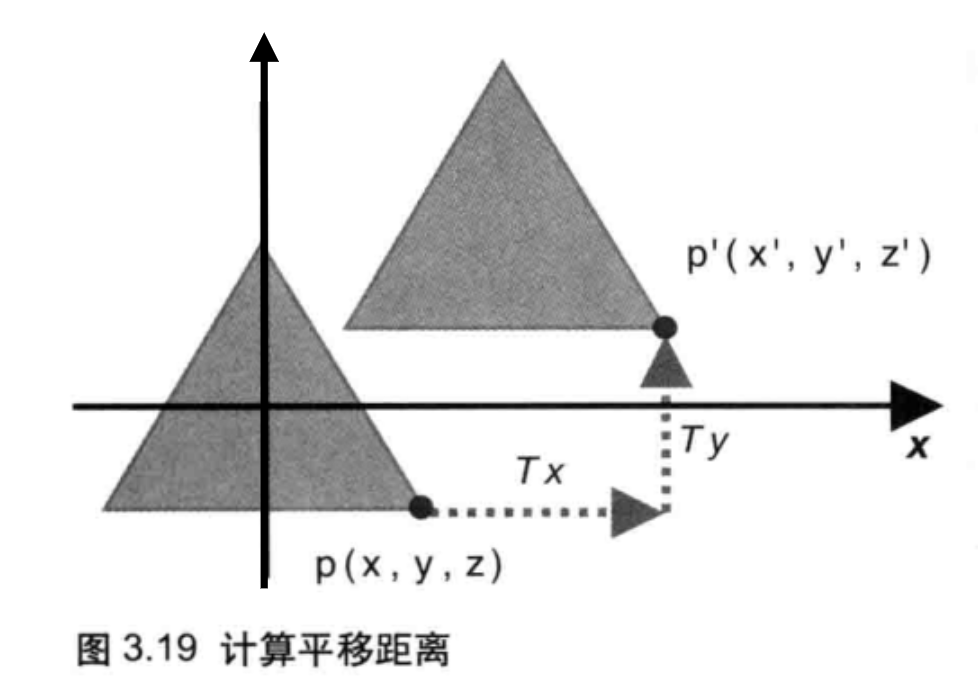
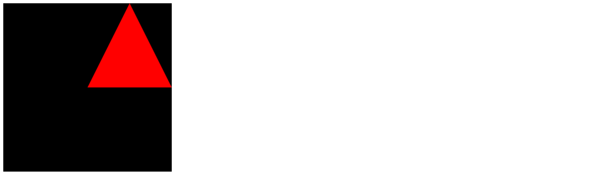
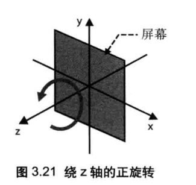
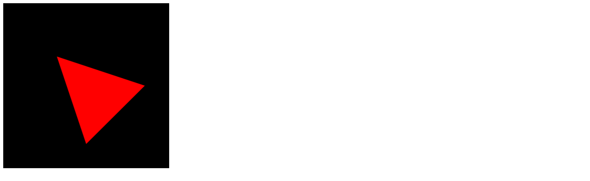

# 平移、旋转和缩放

## 平移

所谓“平移”，无非是对图形的每个顶点做什么样的操作。例如，将点 p(x, y, z) 平移到 p <sub> 1 </sub>(x <sub> 1 </sub>, y <sub> 1 </sub>, z <sub> 1 </sub>)，就是在 X 轴、Y 轴、Z 轴三个方向上平移的距离分别为 T <sub> x </sub>、T <sub> y </sub>、T <sub> z </sub>，其中 T <sub> 1 </sub> 为 0.0。

那么在坐标的对应分量上，直接加上这些 T 值，就可以确定 p <sub> 1 </sub> 的坐标了，如下：

&emsp;&emsp;&emsp;&emsp;&emsp;&emsp;&emsp;&emsp;&emsp;&emsp;&emsp;&emsp;&emsp;&emsp;&emsp;&emsp;&emsp;&emsp; x <sub> 1 </sub> = x + T <sub> z </sub>

&emsp;&emsp;&emsp;&emsp;&emsp;&emsp;&emsp;&emsp;&emsp;&emsp;&emsp;&emsp;&emsp;&emsp;&emsp;&emsp;&emsp;&emsp; y <sub> 1 </sub> = y + T <sub> y </sub>

&emsp;&emsp;&emsp;&emsp;&emsp;&emsp;&emsp;&emsp;&emsp;&emsp;&emsp;&emsp;&emsp;&emsp;&emsp;&emsp;&emsp;&emsp; z <sub> 1 </sub> = z + T <sub> z </sub>



下面的案例创建了一个三角形，并在 X 轴和 Y 轴方向上各增加了 0.5 个分量：

```html {29,32,85,87,92,95}
<!DOCTYPE html>
<html lang="en">
  <head>
    <meta charset="UTF-8">
    <title>平移</title>
  </head>
  <body>
    <canvas id="example" width="400" height="400">
      请使用支持 canvas 的浏览器查看
    </canvas>

    <script>
      const canvas = document.getElementById("example");
      if (!canvas) {
        console.log("Failed to load canvas element.");
      }
      // 获取 webgl 绘图上下文
      const gl = canvas.getContext("webgl");

      // 设置清空背景颜色
      gl.clearColor(0, 0, 0, 1);
      // 清空 canvas 背景
      gl.clear(gl.COLOR_BUFFER_BIT);

      // 创建顶点着色器
      const VSHADER_SOURCE = `
        attribute vec4 a_Position;
        // 平移分量
        uniform vec4 u_Translation;

        void main() {
          gl_Position = a_Position + u_Translation;
        }
      `;
      const vShader = gl.createShader(gl.VERTEX_SHADER);
      // 向顶点着色器中填充着色器程序源码
      gl.shaderSource(vShader, VSHADER_SOURCE);
      // 编译顶点着色器
      gl.compileShader(vShader);

      // 创建片段着色器
      const FSHADER_SOURCE = `
        void main() {
          gl_FragColor = vec4(1.0, 0.0, 0.0, 1.0);
        }
      `;
      const fShader = gl.createShader(gl.FRAGMENT_SHADER);
      // 向片元着色器中填充着色器程序源码
      gl.shaderSource(fShader, FSHADER_SOURCE);
      // 编译片元着色器
      gl.compileShader(fShader);

      // 创建程序对象
      const program = gl.createProgram();
      // 为程序对象分配着色器
      gl.attachShader(program, vShader);
      gl.attachShader(program, fShader);
      // 连接程序对象
      gl.linkProgram(program);
      // 使用程序对象
      gl.useProgram(program);

      // 定义顶点数据，每2个组成一个点，一共3组点
      const vertices = new Float32Array([0.0, 0.5, -0.5, -0.5, 0.5, -0.5]);
      const n = 3; // 点的个数

      // 创建缓冲区
      const buffer = gl.createBuffer();
      // 将缓冲区对象绑定到目标
      gl.bindBuffer(gl.ARRAY_BUFFER, buffer);
      // 向缓冲区对象中写入数据
      gl.bufferData(gl.ARRAY_BUFFER, vertices, gl.STATIC_DRAW);

      // 获取 a_Position 变量的存储地址
      const a_Position = gl.getAttribLocation(program, "a_Position");
      if (a_Position < 0) {
        console.log("Failed to get storage location of a_Position");
      }
      // 将缓冲区对象分配给 a_Position 变量
      gl.vertexAttribPointer(a_Position, 2, gl.FLOAT, false, 0, 0);
      // 连接 a_Position 变量与分配给它的缓冲区对象
      gl.enableVertexAttribArray(a_Position);

      // 定义平移的分量
      const Tx = 0.5, Ty = 0.5, Tz = 0.0;
      // 获取 u_Translation 变量的存储地址
      const u_Translation = gl.getUniformLocation(program, "u_Translation");
      if (!u_Translation) {
        console.log("Failed to get storage location of u_Translation");
      }
      // 分配变量值
      gl.uniform4f(u_Translation, Tx, Ty, Tz, 0.0);

      // 用三个点依次绘制一个三角形
      gl.drawArrays(gl.TRIANGLES, 0, n);
    </script>
  </body>
</html>
```

> [!NOTE] 注意
>
> 1. 由于 T <sub> x </sub>、T <sub> y </sub>、T <sub> z </sub> 对于所有顶点都是固定的，所以这里使用 `uniform` 变量来表示三角形的平移距离。
> 1. `uniform` 变量使用了 `vec4` 作为类型，它的好处是和 `a_Position` 变量的类型一致，可以直接做相加，相对应的矢量分量会被同时相加。
> 1. 需要注意的是，在 `gl.uniform4f(u_Translation, Tx, Ty, Tz, 0.0);` 时，第 4 分量这里设置为 0.0，而不是 1.0。这是因为 `a_Position` 的第 4 分量默认已经是 1.0，而相加后的第 4 分量总和也必须为 1.0，所以 `uniform4f()` 中只能是 0.0。 




## 旋转

旋转比平移要复杂一些，首先需要指明以下三点：

- **旋转轴**（图形将围绕旋转轴旋转）
- **旋转方向**（顺时针或逆时针）
- **旋转角度**（图形旋转经过的角度）


在 WebGL 中，默认使用 **右手旋转法则（逆时针旋转）**，即右手握拳，大拇指朝向眼睛代表 Z轴，其余手指的方向就是旋转的方向。




计算旋转后的坐标，需要使用到三角函数的内容，简化后的公式如下所示：

```latex
x' = x cosβ - y sinβ
y' = x sinβ + y cosβ
z' = z
```

我们只需要把 `sinβ` 和 `cosβ` 的值传递给顶点着色器，然后顶点着色器按照上述公式计算旋转后的点坐标，就可以实现旋转的效果了。


下面案例创建了一个三角形，并沿着 Z轴方向旋转了 45°：

::: code-group

```html [基础版本] {28,31-34,86-89,91,92,94,95}
<!DOCTYPE html>
<html lang="en">
  <head>
    <meta charset="UTF-8">
    <title>旋转</title>
  </head>
  <body>
    <canvas id="example" width="400" height="400">
      请使用支持 canvas 的浏览器查看
    </canvas>

    <script>
      const canvas = document.getElementById("example");
      if (!canvas) {
        console.log("Failed to load canvas element.");
      }
      // 获取 webgl 绘图上下文
      const gl = canvas.getContext("webgl");

      // 设置清空背景颜色
      gl.clearColor(0, 0, 0, 1);
      // 清空 canvas 背景
      gl.clear(gl.COLOR_BUFFER_BIT);

      // 创建顶点着色器
      const VSHADER_SOURCE = `
        attribute vec4 a_Position;
        uniform float u_CosB, u_SinB;

        void main() {
          gl_Position.x = a_Position.x * u_CosB - a_Position.y * u_SinB;
          gl_Position.y = a_Position.x * u_SinB + a_Position.y * u_CosB;
          gl_Position.z = a_Position.z;
          gl_Position.w = 1.0;
        }
      `;
      const vShader = gl.createShader(gl.VERTEX_SHADER);
      // 向顶点着色器中填充着色器程序源码
      gl.shaderSource(vShader, VSHADER_SOURCE);
      // 编译顶点着色器
      gl.compileShader(vShader);

      // 创建片段着色器
      const FSHADER_SOURCE = `
        void main() {
          gl_FragColor = vec4(1.0, 0.0, 0.0, 1.0);
        }
      `;
      const fShader = gl.createShader(gl.FRAGMENT_SHADER);
      // 向片元着色器中填充着色器程序源码
      gl.shaderSource(fShader, FSHADER_SOURCE);
      // 编译片元着色器
      gl.compileShader(fShader);

      // 创建程序对象
      const program = gl.createProgram();
      // 为程序对象分配着色器
      gl.attachShader(program, vShader);
      gl.attachShader(program, fShader);
      // 连接程序对象
      gl.linkProgram(program);
      // 使用程序对象
      gl.useProgram(program);

      // 定义顶点数据，每2个组成一个点，一共3组点
      const vertices = new Float32Array([0.0, 0.5, -0.5, -0.5, 0.5, -0.5]);
      const n = 3; // 点的个数

      // 创建缓冲区
      const buffer = gl.createBuffer();
      // 将缓冲区对象绑定到目标
      gl.bindBuffer(gl.ARRAY_BUFFER, buffer);
      // 向缓冲区对象中写入数据
      gl.bufferData(gl.ARRAY_BUFFER, vertices, gl.STATIC_DRAW);

      // 获取 a_Position 变量的存储地址
      const a_Position = gl.getAttribLocation(program, "a_Position");
      if (a_Position < 0) {
        console.log("Failed to get storage location of a_Position");
      }
      // 将缓冲区对象分配给 a_Position 变量
      gl.vertexAttribPointer(a_Position, 2, gl.FLOAT, false, 0, 0);
      // 连接 a_Position 变量与分配给它的缓冲区对象
      gl.enableVertexAttribArray(a_Position);

      const ANGLE = 45;
      const radian = Math.PI * ANGLE / 180.0; // 转换为弧度制
      const cosB = Math.cos(radian);
      const sinB = Math.sin(radian);

      const u_CosB = gl.getUniformLocation(program, "u_CosB");
      const u_SinB = gl.getUniformLocation(program, "u_SinB");

      gl.uniform1f(u_CosB, cosB);
      gl.uniform1f(u_SinB, sinB);

      // 用三个点依次绘制一个三角形
      gl.drawArrays(gl.TRIANGLES, 0, n);
    </script>
  </body>
</html>
```

```html [优化版本] {28,31-34,86-89,92,93}
<!DOCTYPE html>
<html lang="en">
  <head>
    <meta charset="UTF-8">
    <title>旋转（版本2）</title>
  </head>
  <body>
    <canvas id="example" width="400" height="400">
      请使用支持 canvas 的浏览器查看
    </canvas>

    <script>
      const canvas = document.getElementById("example");
      if (!canvas) {
        console.log("Failed to load canvas element.");
      }
      // 获取 webgl 绘图上下文
      const gl = canvas.getContext("webgl");

      // 设置清空背景颜色
      gl.clearColor(0, 0, 0, 1);
      // 清空 canvas 背景
      gl.clear(gl.COLOR_BUFFER_BIT);

      // 创建顶点着色器
      const VSHADER_SOURCE = `
        attribute vec4 a_Position;
        uniform vec2 u_CosBSinB;

        void main() {
          gl_Position.x = a_Position.x * u_CosBSinB.x - a_Position.y * u_CosBSinB.y;
          gl_Position.y = a_Position.x * u_CosBSinB.y + a_Position.y * u_CosBSinB.x;
          gl_Position.z = a_Position.z;
          gl_Position.w = 1.0;
        }
      `;
      const vShader = gl.createShader(gl.VERTEX_SHADER);
      // 向顶点着色器中填充着色器程序源码
      gl.shaderSource(vShader, VSHADER_SOURCE);
      // 编译顶点着色器
      gl.compileShader(vShader);

      // 创建片段着色器
      const FSHADER_SOURCE = `
        void main() {
          gl_FragColor = vec4(1.0, 0.0, 0.0, 1.0);
        }
      `;
      const fShader = gl.createShader(gl.FRAGMENT_SHADER);
      // 向片元着色器中填充着色器程序源码
      gl.shaderSource(fShader, FSHADER_SOURCE);
      // 编译片元着色器
      gl.compileShader(fShader);

      // 创建程序对象
      const program = gl.createProgram();
      // 为程序对象分配着色器
      gl.attachShader(program, vShader);
      gl.attachShader(program, fShader);
      // 连接程序对象
      gl.linkProgram(program);
      // 使用程序对象
      gl.useProgram(program);

      // 定义顶点数据，每2个组成一个点，一共3组点
      const vertices = new Float32Array([0.0, 0.5, -0.5, -0.5, 0.5, -0.5]);
      const n = 3; // 点的个数

      // 创建缓冲区
      const buffer = gl.createBuffer();
      // 将缓冲区对象绑定到目标
      gl.bindBuffer(gl.ARRAY_BUFFER, buffer);
      // 向缓冲区对象中写入数据
      gl.bufferData(gl.ARRAY_BUFFER, vertices, gl.STATIC_DRAW);

      // 获取 a_Position 变量的存储地址
      const a_Position = gl.getAttribLocation(program, "a_Position");
      if (a_Position < 0) {
        console.log("Failed to get storage location of a_Position");
      }
      // 将缓冲区对象分配给 a_Position 变量
      gl.vertexAttribPointer(a_Position, 2, gl.FLOAT, false, 0, 0);
      // 连接 a_Position 变量与分配给它的缓冲区对象
      gl.enableVertexAttribArray(a_Position);

      const ANGLE = 45;
      const radian = Math.PI * ANGLE / 180.0; // 转换为弧度制
      const cosB = Math.cos(radian);
      const sinB = Math.sin(radian);
      
      // 只需要获取一个变量
      const u_CosBSinB = gl.getUniformLocation(program, "u_CosBSinB");
      gl.uniform2f(u_CosBSinB, cosB, sinB);

      // 用三个点依次绘制一个三角形
      gl.drawArrays(gl.TRIANGLES, 0, n);
    </script>
  </body>
</html>
```

:::




## 变换矩阵

对于简单的变换，可以使用上述的数学表达式来实现。但是当情形变得复杂时（如将案例中的三角形“先旋转后平移”），用数学表达式的方式将会变得非常繁琐。 

而 **变换矩阵**（Transformation matrix）就是专门用于执行复杂的图形变换的，它使用线性代数中的矩阵来计算图形变换后结果。


矩阵和矢量的乘法可以写成下面的形式，通过 “×”号，矩阵（中间）和矢量（右边）相乘，就得到了新的矢量（左边）。
$$
\begin{bmatrix}
x' \\
y' \\
z'
\end{bmatrix}

= 

\begin{bmatrix}
a \;\; b \;\; c \\
d \;\; e \;\; f \\
g \;\; h \;\; i
\end{bmatrix}

×

\begin{bmatrix}
x \\
y \\
z
\end{bmatrix}

\tag{1}
$$
上面的矩阵与矢量相乘，本质上是执行以下数学公式：

```latex
x' = ax + by + cz
y' = dx + ey + fz
z' = gx + hy + iz
```

特殊地：

```latex
% 当 a = cosβ，b = -sinβ，c = 0 时
x' = ax + by + cz  <==>  x' = xcosβ - bsinβ

% 当 d = sinβ，e = cosβ，c = 0 时
y' = dx + ey + fz  <==>  y' = xsinβ + ycosβ
```

接下来，将这些结果带入到上面的矩阵（1）中，得到：
$$
\begin{bmatrix}
x' \\
y' \\
z'
\end{bmatrix}

= 

\begin{bmatrix}
cosβ \;\;\;\; -sinβ \;\;\; 0 \\
sinβ \;\;\;\; cosβ  \;\;\;\;\; 0 \\
0 \;\;\;\;\;\;\;\;\;\; 0 \;\;\;\;\;\;\;\;\;\; 1
\end{bmatrix}

×

\begin{bmatrix}
x \\
y \\
z
\end{bmatrix}
$$


### 平移


### 旋转


### 缩放


